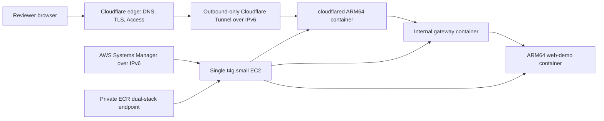

# Cost-Optimized IPv6 ARM64 EC2 And Cloudflare Trial Plan

**Status:** `active` — planning and local validation only

**Objective:** Create a separately bounded, low-cost AWS trial profile that
serves the AviaSurveil360 demo through Cloudflare Tunnel from one IPv6-only
Amazon EC2 `t4g.small` host running ARM64 Docker containers, without an AWS
public IPv4 address, Elastic IP, NAT gateway, or load balancer.

**User-visible outcome:** An owner-approved Cloudflare hostname serves the
existing `candidate-only` demo over HTTPS while the EC2 origin has no inbound
security-group rules and no public IPv4 address. Operators reach the host only
through AWS Systems Manager using IPv6-capable endpoints. The first milestone
is the root demo artifact, not the full HTTP/preprod runtime.

This plan does not supersede the paused
[AWS Preprod Validation Plan](2026-07-27-aws-preprod-validation-plan.md). It is
a smaller, single-node, non-HA experiment and cannot issue `preprod verified`,
`qualified for production deployment planning`, or `production-ready`.

## Current Authorization Boundary

The user authorized planning this architecture. No AWS or Cloudflare
discovery, Terraform/Terragrunt remote plan, state bootstrap, DNS/tunnel
mutation, image publication, apply, smoke test, retain, or destroy action is
authorized by this document. Every remote or cost-bearing action requires a
new explicit authorization bound to the exact account, region, Cloudflare
account/zone, action, plan or artifact hash, budget, expiry, and retain/destroy
decision.

## Confirmed Current Facts

- T4g uses AWS Graviton2 and the `arm64`/`aarch64` architecture.
- The time-limited AWS trial applies specifically to `t4g.small`, not the
  entire T4g family. AWS currently documents up to 750 aggregate instance
  hours per month through 31 December 2026, subject to region availability and
  surplus CPU-credit charges.
- A public IPv4 address is normally billed separately. This plan prevents an
  AWS public IPv4 address from being assigned; it does not claim that the
  complete environment costs zero.
- EC2 instances in an IPv6-only subnet receive no IPv4 address and must use a
  Nitro-based instance. T4g satisfies the ARM64/Nitro direction, but exact
  account/region/AMI availability must be discovered before planning.
- Cloudflare Tunnel establishes outbound-only connections to Cloudflare on
  port 7844 over QUIC/UDP or HTTP/2/TCP. Cloudflare publishes IPv6 endpoints,
  but `cloudflared` defaults its edge IP selection to IPv4. This profile must
  set `TUNNEL_EDGE_IP_VERSION=6` and verify four healthy IPv6 connections.
- The repository's local `full` profile is not a valid `t4g.small` workload.
  It includes many application and infrastructure services, and its ClamAV
  container is explicitly pinned to `linux/amd64`. No amd64 emulation is
  accepted for this trial.

Planning references reviewed on 5 August 2026:

- [AWS EC2 T4g instances](https://aws.amazon.com/ec2/instance-types/t4/)
  and [AWS EC2 FAQ](https://aws.amazon.com/ec2/faqs/) for the ARM64 family and
  time-limited `t4g.small` offer;
- [Amazon VPC pricing](https://aws.amazon.com/vpc/pricing/) and
  [EC2 VPC/IPv6-only subnet guidance](https://docs.aws.amazon.com/AWSEC2/latest/UserGuide/using-vpc.html);
- [Cloudflare Tunnel firewall endpoints](https://developers.cloudflare.com/cloudflare-one/networks/connectors/cloudflare-tunnel/configure-tunnels/tunnel-with-firewall/)
  and [cloudflared edge IP version](https://developers.cloudflare.com/tunnel/advanced/run-parameters/#edge-ip-version);
- [Amazon ECR IPv6 requests](https://docs.aws.amazon.com/AmazonECR/latest/userguide/ecr-requests.html)
  and [AWS Systems Manager IPv6 endpoints](https://docs.aws.amazon.com/systems-manager/latest/userguide/setup-create-vpc.html); and
- [Cloudflare Tunnel with Terraform](https://developers.cloudflare.com/tunnel/deployment-guides/terraform/)
  and the [Cloudflare Terraform provider](https://registry.terraform.io/providers/cloudflare/cloudflare/latest/docs).

## Scope

- A new `aws-ipv6-trial` Terragrunt environment that leaves the existing
  `aws-trial` and paused AWS preprod topology intact.
- A dual-stack VPC containing one IPv6-native subnet in one availability zone;
  the VPC retains the AWS-required private IPv4 CIDR, but the runtime subnet
  and EC2 network interface are IPv6-only.
- One `t4g.small` instance using an explicit, owner-approved ARM64 Amazon Linux
  2023 AMI resolved through an AWS-owned SSM public parameter during an
  authorized plan.
- One encrypted `gp3` root volume with a reviewed size and deletion behavior.
- No public IPv4, Elastic IP, NAT gateway, ALB/NLB, RDS, interface VPC endpoint,
  bastion, or inbound security-group rule.
- An Internet Gateway and an IPv6 default route for outbound Cloudflare, AWS
  dual-stack endpoints, package/bootstrap, and image-pull traffic.
- Systems Manager Session Manager configured for IPv6 dual-stack service
  endpoints; no SSH key and no port 22 exposure.
- Private ECR repositories and digest-bound `linux/arm64` OCI images pulled
  through ECR's IPv6-capable dual-stack API and registry endpoints.
- A remotely managed Cloudflare Tunnel, its public hostname, and an optional
  but default-on Cloudflare Access allowlist.
- A dedicated Docker Compose trial profile with no host-published application
  ports.
- AWS Budget/cost evidence and plan-policy denials for known accidental cost
  multipliers.
- Phase-specific plan/apply/verify/destroy evidence without production claims.

## Explicit Exclusions

- AWS preprod or production validation, production DNS/traffic, real customer
  data, production identity federation, and legal/regulatory approval.
- High availability, multi-AZ runtime, autoscaling, load balancers, RDS,
  managed backups, host-loss DR, or production RPO/RTO.
- The full local Compose profile on `t4g.small`.
- Keycloak, ClamAV, MinIO, Gotenberg, Mailpit, the LGTM observability stack,
  workers, scheduler, and other backend dependencies in milestone 1.
- amd64 images, QEMU/Rosetta emulation, or a compatibility fallback.
- Direct inbound HTTP/HTTPS/SSH access to the EC2 IPv6 address.
- Treating Cloudflare Access as application role authorization. Product roles
  and organization privacy boundaries remain application responsibilities.
- Storing Cloudflare or AWS secret values in Git, user data, shell history,
  logs, plan evidence, or unencrypted local artifacts.

## Assumptions And Owner Inputs

No remote plan may run until an untracked owner overlay supplies and the
decision contract validates:

| Input | Required decision |
|---|---|
| AWS account | Exact account ID and approved operator role |
| AWS region | A region that supports the T4g trial and the selected ARM64 AMI; `eu-central-1` is only a candidate, not a committed default |
| Availability zone | One approved zone after T4g capacity discovery |
| Cloudflare | Account ID, existing zone ID, hostname, and least-privilege API token source |
| Access policy | Exact allowed identities/domains or an explicit owner decision to expose the synthetic demo publicly |
| Runtime | Milestone 1 `demo` profile acceptance; no inference that `full` is approved |
| Cost | Monthly and one-run USD ceilings, alert recipients, expiry, and automatic stop condition |
| Persistence | Root-volume size, deletion behavior, and whether any snapshot is retained |
| Lifecycle | Exact trial expiry and retain or scoped-destroy decision |
| Ownership | Platform, security, DNS, cost, and rollback/destroy owners |

The AWS T4g promotion may change or expire. A fresh official pricing and
eligibility check is a blocking input to every cost-bearing plan.

## Target Architecture



### Network Contract

- The VPC receives an Amazon-provided IPv6 `/56`; the trial subnet receives an
  IPv6 `/64` and is declared IPv6-native.
- The instance network interface has a primary IPv6 address and no private or
  public IPv4 address other than AWS-defined link-local behavior.
- The route table sends `::/0` to the Internet Gateway. It has no
  `0.0.0.0/0`, NAT gateway, NAT instance, or egress-only IPv4 path.
- The security group has zero ingress rules. Egress initially permits the
  exact Cloudflare Tunnel IPv6 ranges on TCP/UDP 7844, DNS resolution, and the
  reviewed IPv6 destinations needed for AWS management and image delivery.
  Any broader bootstrap HTTPS egress must be documented, time-bounded where
  practical, and verified as outbound only.
- Neither the trial Compose file nor systemd publishes application ports on
  the EC2 host. `cloudflared` reaches the gateway on a private Docker network.
- The origin records the verified `CF-Connecting-IP` value for bounded HTTP
  audit context where required; it never makes authorization decisions from
  that header alone.

### ARM64 Runtime Contract

- `uname -m` must report `aarch64`.
- Every application and third-party OCI subject must contain a
  `linux/arm64` manifest. A single-platform amd64 subject fails the gate.
- First milestone services are `cloudflared`, an internal gateway, and
  `web-demo`. They run from immutable digests with read-only filesystems,
  dropped capabilities, `no-new-privileges`, health checks, bounded PIDs,
  bounded memory, and restart policies.
- The Compose artifact is purpose-built under `deploy/aws-ipv6-trial/`; it does
  not reuse the local host-port and internal-TLS assumptions unchanged.
- The gateway listens only on the private Compose network. Cloudflare owns
  reviewer-facing TLS; the tunnel protects the edge-to-connector hop. No
  `noTLSVerify` origin bypass is allowed.
- Runtime secrets are fetched at boot through the instance role and written
  only to root-owned `0600` runtime files or Docker secrets. User data contains
  parameter names/ARNs, never secret values.
- Docker and SSM bootstrapping must work on an IPv6-only host. The plan cannot
  assume the ordinary IPv4 ECR names: AWS CLI/SDK calls use
  `ecr.<region>.api.aws`, and Docker pulls use
  `<account>.dkr-ecr.<region>.on.aws`.
- SSM Agent enables `UseDualStackEndpoint`; IMDSv2 is required and its IPv6
  endpoint is explicitly enabled.

### Capacity Contract

`t4g.small` has only 2 GiB of memory. The milestone-1 runtime must be measured
locally on ARM64 and again on EC2. Acceptance requires:

- no swap dependency or kernel OOM event;
- at least 20% host memory headroom after a 30-minute browser smoke loop;
- no container restart, unhealthy state, or continuously worsening CPU-credit
  balance under the bounded trial workload;
- root-volume usage below 70% after image pull and log rotation; and
- a documented stop rather than silently changing to a larger instance.

Any HTTP/backend expansion requires a separate resource profile, ARM64 image
inventory, and owner cost decision. A measured need for more memory leads to a
new paid-capacity plan; it does not add swap as a permanent workaround.

## Terragrunt And Terraform Layout

Planned repository additions:

```text
infra/terraform/modules/
  ipv6-trial-network/
  arm64-single-node/
  cloudflare-edge-runtime-auth/
  trial-budget/
infra/terragrunt/environments/aws-ipv6-trial/
  account.hcl
  environment.hcl
  region.hcl.example
  components/
    network/terragrunt.hcl
    registry/terragrunt.hcl
    edge-runtime-auth/terragrunt.hcl
    budget/terragrunt.hcl
    compute/terragrunt.hcl
deploy/aws-ipv6-trial/
  compose.yaml
  gateway/Caddyfile
docs/operations/
  AWS_IPV6_TRIAL_DECISIONS.md
  AWS_IPV6_TRIAL_RUNBOOK.md
```

Reuse the existing remote-state bootstrap, ECR, artifact-contract, policy, and
protected plan-wrapper code where their contracts still fit. Do not add
backward-compatibility branches to ALB/private-subnet modules whose invariants
conflict with this topology; add focused modules for the distinct trial.

The dependency-valid wave order is:

1. local contracts and ARM64 artifact validation;
2. remote-state bootstrap;
3. IPv6 network, ECR registry, and budget guardrails;
4. ARM64 artifact publication;
5. Cloudflare tunnel/DNS/Access plus its AWS runtime-auth parameter in one
   state boundary, so the connector token is not copied through Terragrunt
   dependency outputs;
6. EC2 compute and Docker runtime;
7. smoke and bounded observation;
8. separately authorized retain or scoped destroy, followed by a separately
   authorized residue query.

Every wave is planned from real outputs of already applied dependencies.
Dependency mocks are allowed only for offline validation and can never produce
an apply-approved plan.

## Secret And State Contract

- Cloudflare Terraform uses a least-privilege API token supplied through
  `CLOUDFLARE_API_TOKEN`; it is never a Terragrunt input literal.
- The tunnel connector token is sensitive. The edge/runtime-auth Terraform
  state may contain it, so that state is encrypted, access-restricted,
  versioned, and never committed or copied to evidence.
- The connector token is stored in an AWS SSM `SecureString` parameter and
  readable only by the exact EC2 instance role. Rotation creates a new
  reviewed state/action cycle.
- Terraform plan JSON, Terragrunt logs, and CI output must be scanned for the
  token and Cloudflare API token. Any occurrence blocks the wave.
- State uses the existing versioned S3 backend and native S3 lockfile. Remote
  plan lock acquisition is an AWS write and requires the same explicit
  authorization discipline as the existing AWS plans.

## Cost Guardrails

The policy layer must reject a plan containing any of the following unless a
new plan explicitly changes this trial's objective:

- an EC2 type other than `t4g.small`;
- a public IPv4 address, Elastic IP, NAT gateway, load balancer, RDS instance,
  interface VPC endpoint, or autoscaling group;
- more than one running EC2 instance;
- an unbounded or non-`gp3` root volume;
- an unapproved paid Marketplace AMI;
- mutable image tags or non-ARM64 artifacts;
- log, ECR, S3, snapshot, or state retention without a bounded lifecycle;
- missing AWS Budget alerts, trial expiry, or retain/destroy decision.

The cost estimate must still include EBS, ECR storage/scanning, S3 state,
CloudWatch logs/metrics, snapshots if selected, Internet data transfer, Route
53 if used, surplus T4g CPU credits, and post-31-December-2026 EC2 price. The
one avoided AWS public IPv4 address is only one line item, not proof of a zero
bill.

## Tasks

### Task 1: Freeze Trial Decisions And Runtime Boundary

**Files**

- Create `docs/operations/AWS_IPV6_TRIAL_DECISIONS.md`.
- Create `tests/aws-ipv6-trial-decision-contract.test.mjs`.
- Create `scripts/check-aws-ipv6-trial-decisions.sh`.

**Work**

- Record every owner input from the table above without secret values.
- Freeze milestone 1 to the synthetic root demo and its exact hostname/Access
  audience.
- Record the official T4g promotion evidence date, eligible region, instance
  hours, CPU-credit caveat, ordinary on-demand price after expiry, and complete
  non-compute cost ceiling.
- Fail closed on missing, stale, contradictory, or over-budget inputs.

**Verification**

    node --test tests/aws-ipv6-trial-decision-contract.test.mjs
    ./scripts/check-aws-ipv6-trial-decisions.sh

Expected: incomplete or stale decisions fail without AWS or Cloudflare calls.

### Task 2: Prove The Minimal Runtime Is ARM64 And Fits

**Files**

- Create `deploy/aws-ipv6-trial/compose.yaml` and the internal gateway config.
- Create `scripts/build-aws-ipv6-trial-images.sh`.
- Create `scripts/test-aws-ipv6-trial-runtime.sh`.
- Create `tests/aws-ipv6-trial-runtime-contract.test.mjs`.

**Work**

- Build the gateway and demo artifact for `linux/arm64` with immutable OCI
  subject metadata, SBOMs, provenance, and vulnerability scans.
- Select an ARM64 `cloudflared` digest only after its manifest and scan pass.
- Reject `platform: linux/amd64`, emulation, mutable tags, published host ports,
  privileged containers, and secret literals.
- Run the three-service profile locally on ARM64 and measure memory, CPU,
  filesystem growth, health, restarts, and 30-minute browser-loop behavior.
- Record a literal GO/NO-GO for `t4g.small`; do not weaken the threshold to
  manufacture a pass.

**Verification**

    node --test tests/aws-ipv6-trial-runtime-contract.test.mjs
    ./scripts/build-aws-ipv6-trial-images.sh --platform linux/arm64
    ./scripts/test-aws-ipv6-trial-runtime.sh

Expected: all image manifests are ARM64, the demo routes work, capacity gates
pass, and task-owned containers/networks/volumes are cleaned up.

### Task 3: Implement And Test The IPv6 Trial Modules

**Files**

- Create the four focused Terraform modules and native tests described above.
- Extend AWS plan OPA policy with IPv4/cost/ARM64 mutation cases.
- Add Cloudflare provider and tunnel/DNS/Access contract tests.

**Work**

- Implement the IPv6-native subnet, no-ingress security group, one ARM64
  instance, IMDSv2/IPv6, SSM dual-stack configuration, encrypted volume,
  budget, tunnel/DNS/Access, and secure connector-token handoff.
- Use pinned Terraform AWS and Cloudflare provider versions and dependency
  locks.
- Prove user data contains no secret value, the instance gets no IPv4 address,
  and no prohibited paid resource appears in plan JSON.

**Verification**

    terraform -chdir=infra/terraform fmt -check -recursive
    terraform -chdir=infra/terraform test
    tflint --chdir infra/terraform --recursive
    trivy config --severity HIGH,CRITICAL --exit-code 1 infra/terraform
    node --test tests/aws-ipv6-trial-*.test.mjs

Expected: native tests and every unsafe plan mutation pass locally with no
remote calls.

### Task 4: Compose The Terragrunt Environment And Offline Plan Fixtures

**Files**

- Create `infra/terragrunt/environments/aws-ipv6-trial/`.
- Extend the component catalog without changing `aws-trial` semantics.
- Create `scripts/check-aws-ipv6-trial-terragrunt.sh` and fixtures.

**Work**

- Generate AWS and Cloudflare providers only in the components that require
  them.
- Keep account, region, zone, hostname, cost, and secret inputs absent from
  committed defaults.
- Freeze the dependency graph and one-wave plan artifact contract.
- Run only local-state/mocked-output fixtures; mocks fail during apply.

**Verification**

    terragrunt hcl fmt --check
    ./scripts/check-aws-ipv6-trial-terragrunt.sh

Expected: deterministic dependency order, protected plan artifacts, empty OPA
denial sets, and zero AWS/Cloudflare actions.

### Task 5: Run Separately Authorized Discovery And Plan Waves

**Work**

- With a new exact read-only authorization, verify caller/account, eligible
  region/AZ, T4g offer, ARM64 AMI, quotas, Cloudflare zone/account, conflicting
  DNS/tunnels, and estimated cost.
- Stop. With a separate lock/write authorization, plan only the next wave from
  current upstream state, redact it, review its policy/cost/security output,
  and record the exact binary/JSON/hash.
- Never combine discovery, plan, and apply authority.

Expected: a current GO/NO-GO and one reviewed wave plan; no apply.

### Task 6: Apply One Wave At A Time And Publish ARM64 Artifacts

**Work**

- Apply bootstrap, foundation, artifact publication, edge/runtime-auth, and
  compute as separately authorized actions with a stop after each.
- Publish exact `linux/arm64` manifests through ECR's IPv6-capable endpoint and
  compare remote OCI manifest bytes/digests to the local promotion root.
- Start the Compose profile through systemd and verify connector-token file
  permissions and absence from logs/user data.

Expected: only the authorized wave changes; the instance eventually reports
healthy without an AWS public IPv4 address or inbound rule.

### Task 7: Verify Edge, Origin Isolation, Capacity, And Cost

**Work**

- Through separately authorized SSM and external smoke actions, prove
  `aarch64`, IPv6 egress, SSM dual-stack health, four healthy Cloudflare Tunnel
  IPv6 connections, valid public HTTPS, Access enforcement, application
  routes, headers, and browser behavior.
- Prove the EC2 origin is not directly reachable, no application port is
  published, and AWS reports zero public IPv4 addresses for trial resources.
- Run the bounded 30-minute smoke/capacity observation and inspect OOM,
  restart, disk, CPU-credit, and cost evidence.
- Record actual spend and projected month-end spend; stop on the lower of the
  technical or budget threshold.

Expected: the exact synthetic demo is `verified locally` plus bounded cloud
trial evidence. It remains `candidate-only`, `release pending`, and
`production-ready: not established`.

### Task 8: Retain Or Destroy And Reconcile Evidence

**Work**

- Obtain a separate authorization for exactly one of retain or scoped destroy.
- Retain binds continuing cost, expiry, patching, token rotation, and owner.
- Scoped destroy binds exact state/resource/tag allowlists and preserves only
  explicitly approved state/evidence.
- Run a separately authorized read-only residue query and reconcile the plan,
  index, build summary, and technical-debt tracker.

Expected: the selected lifecycle is proven and no unowned billable residue is
silently left behind.

## Acceptance Criteria

- All milestone-1 OCI subjects are `linux/arm64`; zero amd64/emulated subject.
- The instance is exactly `t4g.small`, reports `aarch64`, and satisfies the
  capacity contract.
- EC2 has no public IPv4/EIP and the trial owns no NAT gateway or load balancer.
- The security group has zero ingress rules and Docker publishes no app port.
- Cloudflare Tunnel uses IPv6 edge connections and the approved hostname works
  through Cloudflare HTTPS/Access.
- SSM administration works through IPv6-capable endpoints; SSH is absent.
- Secrets do not appear in Git, user data, logs, plan evidence, or unencrypted
  local files.
- Actual and projected cost remain under the approved ceilings.
- Evidence uses `candidate-only`, `release pending`, and
  `production-ready: not established` literally.

## Risks And Mitigations

| Risk | Mitigation |
|---|---|
| `t4g.small` is treated as free indefinitely | Fresh pricing eligibility gate; expiry alert and destroy/replan before 31 December 2026 |
| ARM64 host receives an amd64 image | OCI manifest policy, local ARM64 run, and no-emulation contract |
| Full Compose stack exhausts 2 GiB | Milestone 1 is demo-only; measured headroom gate before any expansion |
| IPv6-only bootstrap reaches an IPv4-only dependency | Dual-stack AWS endpoints, explicit Cloudflare IPv6, connectivity preflight, and no hidden NAT fallback |
| Tunnel token leaks through Terraform | Single sensitive state boundary, encrypted restricted state, redaction scans, and SSM SecureString handoff |
| Origin becomes directly reachable | Zero SG ingress, no host ports, external IPv6 reachability negative test |
| Cloudflare is mistaken for application authorization | Default Access allowlist plus unchanged in-app role/privacy rules |
| Free compute is mistaken for a zero bill | Full cost inventory, AWS Budget, month-end forecast, and stop threshold |
| Single node is mistaken for preprod/production | Separate environment and fixed `candidate-only` evidence labels |

## Idempotence And Recovery

- Local builds and fixtures use task-owned names and clean up only their own
  resources.
- Remote plans are immutable, short-lived, hash-bound, and invalidated by any
  upstream state, provider lock, owner input, price, artifact, or policy change.
- The instance is replaceable from the exact AMI, Compose bundle, secret
  references, and image digests. Milestone 1 contains no authoritative remote
  application data.
- Tunnel/DNS changes are reversible through their exact prior state. Token
  rotation is a forward action; old tokens are revoked only after the new
  connector is healthy.
- No broad `run --all destroy` or account-wide deletion is allowed. Destroy
  uses exact component state and resource/tag allowlists.
- Failure evidence is preserved; a failed cloud trial is never rewritten into
  passing local evidence.

## Progress

- [x] (2026-08-05) User selected IPv6 plus Cloudflare Tunnel to avoid an AWS
  public IPv4 address and selected Docker on T4g.
- [x] (2026-08-05) ARM64 was made a mandatory runtime boundary.
- [x] (2026-08-05) Official current T4g, public IPv4, IPv6-only EC2,
  Cloudflare Tunnel IPv6, ECR dual-stack, and SSM dual-stack documentation was
  reviewed for planning.
- [x] (2026-08-05) Existing IaC and active AWS preprod constraints were
  inspected. This low-cost trial is intentionally separate.
- [ ] Task 1 owner inputs and local decision contract.

## Decisions

- Use `t4g.small`, not `t4g.medium`, for the time-limited free-compute trial.
- Make the runtime ARM64-only and fail on emulation or amd64 artifacts.
- Deliver the root demo first; grow only after a working measured layer exists.
- Use Cloudflare Tunnel as the only public application path and SSM as the only
  administration path.
- Keep the existing ALB/RDS AWS preprod plan paused and unchanged.
- Treat the environment as disposable `candidate-only` trial infrastructure.

## Discoveries

- The existing Terraform network and compute modules enforce a two-AZ,
  private-subnet, ALB/ASG topology and cannot represent this trial without
  weakening their accepted invariants.
- The existing compute user data uses IPv4-style ECR and Secrets Manager
  endpoints and disables IMDS IPv6; a new focused compute module is required.
- The root `demo` Compose profile is the smallest current end-to-end UI layer,
  but it still needs a trial-specific no-host-port gateway contract.
- The local full profile contains an amd64-only ClamAV image and is outside
  this plan's first milestone.
- T4g free-compute eligibility does not cover EBS, ECR, state, logs, data
  transfer, optional snapshots, surplus CPU credits, or post-expiry compute.

## Outcome Notes

Planning artifact only. Local implementation, local ARM64 capacity evidence,
AWS/Cloudflare discovery, remote state, plans, applies, image publication,
tunnel/DNS changes, smoke, retain/destroy, and production actions are
`not run`. Publishing this planning artifact does not authorize any of those
actions.

## Execution Prompt

```text
Execute docs/exec-plans/active/2026-08-05-cost-optimized-ipv6-arm64-ec2-cloudflare-trial-plan.md from Task 1. Read AGENTS.md, docs/PLANS.md, this plan, the completed reliability/DR/AWS Terragrunt plan, and the paused AWS preprod validation plan before changing infrastructure code.

Keep this as a separate candidate-only aws-ipv6-trial environment. The first working layer is exactly ARM64 cloudflared + internal gateway + web-demo on a measured t4g.small budget. Reject amd64, emulation, public IPv4, EIP, NAT, load balancer, RDS, inbound security-group rules, host-published app ports, secret literals, and production/preprod claims. Reuse established modules and wrappers only when their contracts fit; create focused modules instead of weakening accepted ALB/two-AZ invariants.

Run local contracts and ARM64 capacity tests before any remote action. No AWS or Cloudflare call is authorized by the plan. Discovery, remote-state bootstrap/lock, each plan, each apply, ARM64 artifact publication, tunnel/DNS/Access mutation, secret population, compute start, smoke, retain/destroy, and residue query each require a separate current authorization bound to exact subjects, hashes, budget, expiry, and next stop. Preserve failure evidence, clean only task-owned local resources, and report the result as candidate-only, release pending, and production-ready: not established.
```
