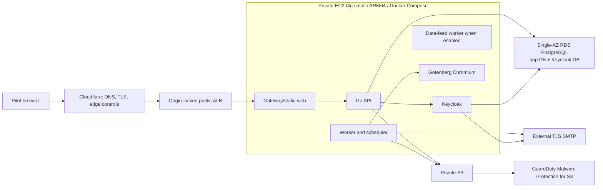

# AWS Single-AZ ARM64 Private-Pilot Production Preparation ExecPlan

This ExecPlan is a living document. Keep `Progress`, `Decision Log`,
`Discoveries`, and `Outcome` synchronized with actual work. Follow
[`docs/PLANS.md`](../../PLANS.md), the repository
[`AGENTS.md`](../../../AGENTS.md), and the literal evidence vocabulary in the
[`output contract`](../../agent-harness/output-contract.md).

## Status

- Plan status: `active` — the target architecture is accepted and local
  implementation preparation is authorized.
- Current result: plan-only; implementation and verification are `not run`.
- Remote authority: none. This plan does not authorize AWS or Cloudflare
  discovery, state/lock writes, provider initialization that contacts a remote
  service, image publication, DNS/certificate mutation, secret creation,
  Terraform/Terragrunt plan or apply against AWS, deployment, SMTP delivery,
  production data, traffic routing, rollback, retain/destroy, or residue
  queries.
- Next: execute Task 1 locally, then implement the smallest end-to-end
  production-profile slice without contacting AWS or another external system.
- Result boundary: local completion can establish only `candidate-only`,
  `release pending`, and `production-ready: not established`.

## Objective

Prepare a cost-bounded AWS private-pilot production architecture for
AviaSurveil360 that runs the application on one ARM64 EC2 `t4g.small` host
using a dedicated production Docker Compose definition, while moving
authoritative PostgreSQL data to one private Single-AZ RDS instance, object
data to private S3, malware scanning to GuardDuty Malware Protection for S3,
and mail delivery to an external TLS SMTP provider.

The local implementation must make this topology deployable and verifiable
without silently turning the existing local Compose stack into a production
artifact. A later, separately authorized release action must still prove the
exact account, region, capacity, recovery, identity, operations, and legal
inputs before real pilot traffic.

## User-Visible Outcome

After the local preparation and later separately authorized deployment gates
are complete, a small set of approved pilot users can access the canonical
AviaSurveil360 workflow through Cloudflare and an origin-locked AWS
Application Load Balancer. The environment remains deliberately Single-AZ and
does not claim high availability. Uploaded Evidence remains private and is not
reviewable or downloadable until the exact object version has a clean managed
malware-scan result. Generated reports remain server-rendered and private.

## Relationship To Existing Plans

- This is the deployment-preparation successor required by the production
  release/operations gate in the
  [React Vite PWA And Go Offline-First Production Plan](2026-07-20-react-vite-pwa-go-offline-first-production-plan.md).
- It does not supersede the paused
  [AWS Preprod Validation Plan](2026-07-27-aws-preprod-validation-plan.md).
  Production cutover remains blocked until the applicable preprod and release
  gates are explicitly dispositioned.
- It does not supersede or expand the disposable
  [Cost-Optimized IPv6 ARM64 EC2 And Cloudflare Trial](2026-08-05-cost-optimized-ipv6-arm64-ec2-cloudflare-trial-plan.md).
  That trial remains a three-service, Tunnel-based, candidate-only demo. Its
  no-ALB/no-RDS topology must not be mutated into this production target.
- The existing `deploy/local/` stack remains the local development and
  integration harness. Production receives a separate definition and never
  inherits local database, MinIO, Mailpit, fixture, loader, or test services.

## Current Authorization Boundary

The user has authorized repository planning and a new implementation task for
the local preparation described in Tasks 1–6. This includes source, tests,
production Compose, local policy, Terraform/Terragrunt modules and fixtures,
runbooks, and documentation changes that make no remote call.

The following remain separate explicit approvals:

1. read-only AWS/Cloudflare/provider discovery;
2. remote-state bootstrap or lock acquisition;
3. each real Terraform/Terragrunt plan;
4. each reviewed apply wave;
5. artifact publication and signing;
6. DNS, TLS, Cloudflare, or origin-authentication changes;
7. secret and SMTP credential population;
8. database bootstrap and migrations against RDS;
9. pilot identity provisioning and any synthetic or real data load;
10. remote functional, security, load, failure, recovery, or restore test;
11. deployment, traffic routing, release, rollback, retention, destruction,
    or residue inspection.

Plan creation and local implementation never imply any of those authorities.

## Accepted Architecture Decisions

| Area | Accepted private-pilot value |
|---|---|
| Edge | Cloudflare proxy in front of an internet-facing, origin-locked ALB. AWS WAF is not included. Cloudflare edge controls and application rate limits remain required. |
| Availability | One workload AZ and one running application host. The environment is explicitly non-HA. A second AZ contains only the subnets required by ALB and the RDS DB subnet group. |
| Compute | Exactly one On-Demand ARM64 EC2 `t4g.small`; no amd64 image, emulation, ASG fleet, ECS, EKS, or Kubernetes. The selection uses the current time-limited T4g offer only after a fresh eligibility check; revisit the instance type only from measured capacity evidence. |
| Runtime | Raw Docker Engine plus a dedicated production Docker Compose definition. A host `systemd` unit owns Compose startup/restart; application and dependency services are not installed natively on the host. |
| Long-running containers | Gateway/static web, Go API, Go worker, scheduler, data-feed worker when enabled by the accepted release, Keycloak, and Gotenberg Chromium. Migration and bootstrap commands are bounded one-shot jobs. |
| Production exclusions | PostgreSQL, Keycloak PostgreSQL, MinIO, Mailpit, ClamAV, local volume-init/tooling, seed, fixture, loader, backup-MinIO, Prometheus, Grafana, Loki, Tempo, and Alertmanager containers are absent from the production Compose definition. |
| Database | One encrypted private PostgreSQL RDS `db.t4g.micro`, Single-AZ, with two separate logical databases and least-privilege roles: `aviasurveil360`/application role and `keycloak`/Keycloak role. `db.t4g.small` is the first measured upgrade, not the starting size. |
| Object storage | Private S3 buckets with public-access block, TLS, versioning, encryption, bounded lifecycle, exact non-overwriting keys, and EC2 instance-role access. No MinIO production fallback and no long-lived S3 access keys. |
| Malware scanning | No ClamAV production container. Use standalone GuardDuty Malware Protection for S3 on untrusted upload bucket/prefixes. Only the exact `NO_THREATS_FOUND` object version may be promoted to canonical storage or marked `CLEAN`. |
| Email | External owner-approved TLS/STARTTLS SMTP. No SES and no Mailpit in production. API/worker and Keycloak use separately scoped credentials where the provider supports them. |
| PDF rendering | Internal-only ARM64 Gotenberg Chromium container, one concurrent render initially. It is never routed through ALB or exposed to the public internet. |
| Egress | One NAT Gateway in the workload AZ for non-S3 outbound traffic. One S3 Gateway Endpoint serves EC2-to-S3 traffic. Do not add an interface-endpoint fleet without measured cost/security justification. |
| Observability | Structured application/gateway logs plus host/container metrics exported to CloudWatch with bounded retention. The local LGTM stack is not copied to production. |
| Recovery target | Initial engineering targets are RPO <= 15 minutes and RTO <= 4 hours for the private pilot, subject to measured restore evidence and owner acceptance. RDS PITR starts at 14 days, AWS Backup recovery points at 35 days, and CloudWatch logs at 30 days. These are operational defaults, not legal retention or legal-hold policy. |
| Records boundary | No automatic Evidence/configuration/audit-history deletion. Legal hold, regulatory retention, disposition, and deletion authority remain blocked owner decisions. |

## Mandatory Two-AZ Network Skeleton

The product workload remains Single-AZ, but AWS imposes two structural subnet
requirements:

- Application Load Balancers require subnets in at least two Availability
  Zones. See the AWS
  [Application Load Balancer subnet requirements](https://docs.aws.amazon.com/elasticloadbalancing/latest/application/application-load-balancers.html#subnets-load-balancer).
- An RDS DB subnet group must contain subnets in at least two Availability
  Zones. See the AWS
  [`CreateDBSubnetGroup` contract](https://docs.aws.amazon.com/AmazonRDS/latest/APIReference/API_CreateDBSubnetGroup.html).

Therefore the accepted VPC shape is:

```text
VPC
├── Availability Zone A
│   ├── public-alb-a
│   ├── private-app-a        -> one t4g.small EC2
│   ├── private-db-a         -> Single-AZ RDS placement candidate
│   └── one NAT Gateway
└── Availability Zone B
    ├── public-alb-b         -> ALB requirement only
    └── private-db-b         -> RDS subnet-group requirement only
```

There is no second EC2 target, RDS standby, second NAT Gateway, or implied HA
claim. Cross-zone ALB traffic to the single target and the extra subnet
scaffolding are accepted private-pilot costs.

## Target Runtime And Trust Boundaries



### Edge And Origin Lock

- Cloudflare is the only intended public client path.
- ALB listens on HTTPS and forwards only to the gateway target port.
- The ALB security group accepts only current Cloudflare proxy CIDRs and
  explicitly approved health/operations sources.
- The gateway validates an origin-authentication control in addition to the
  CIDR restriction. Task 1 must select and test one supported branch:
  Cloudflare Authenticated Origin Pulls/mTLS where compatible with the ALB
  listener, or a rotated secret request header injected only by Cloudflare.
- Direct ALB requests with the correct Host header but without the origin
  control fail closed. Wrong-host requests fail closed.
- Keycloak public login endpoints are routed deliberately; Keycloak admin and
  management endpoints are not publicly routed.
- Gotenberg, database, worker, scheduler, Docker API, metrics, and management
  endpoints have no public listener.

### Production Compose Contract

- Create a distinct production surface such as `deploy/aws-private-pilot/`.
  Do not make production depend on choosing the correct profile inside
  `deploy/local/compose.yaml`.
- Pin every image by immutable digest and require a `linux/arm64` manifest.
- Build application images outside the EC2 host and pull exact subjects from
  ECR only after a separately authorized publication action.
- Use non-root users, `no-new-privileges`, dropped capabilities, bounded PIDs,
  explicit CPU/memory limits, health checks, restart policies, and the smallest
  writable filesystems/temporary mounts each service needs.
- Publish only the gateway target port to the host. All other ports remain on
  internal Compose networks.
- Never mount the Docker socket into an application container.
- Runtime secrets are fetched through the instance role and exposed through
  root-owned runtime files or Docker secrets. Secret values never appear in
  Git, image layers, Compose YAML, user data, Terraform inputs/state where
  avoidable, logs, command lines, or evidence.
- The host CloudWatch Agent and SSM Agent may run natively. Application,
  Keycloak, and Gotenberg remain containerized.
- Docker Compose itself is supervised by a hardened `systemd` unit with
  explicit startup, graceful shutdown, health verification, and rollback
  behavior.

Docker documents single-host production Compose and recommends a separate
production configuration surface. Gotenberg documents container deployment,
an internal-only security posture, and a minimum memory allocation. See
[Docker Compose in production](https://docs.docker.com/compose/how-tos/production/)
and [Gotenberg installation](https://gotenberg.dev/docs/getting-started/installation).

### RDS Contract

- Start with one `db.t4g.micro` PostgreSQL instance in one AZ, encrypted and
  not publicly accessible.
- Create `aviasurveil360` and `keycloak` as separate databases with separate
  non-owner runtime roles. Neither role can connect to or modify the other's
  database.
- A bounded bootstrap/migration identity creates databases/roles and applies
  application migrations. It is not retained by normal runtime containers.
- Application migrations never modify Keycloak-owned tables. Keycloak owns
  its database schema lifecycle.
- The shared instance is an explicitly accepted cost optimization and shared
  failure/recovery boundary. Backup and restore evidence must prove both
  logical databases from one coordinated recovery point.
- Connection-pool totals across API, workers, scheduler, data-feed worker, and
  Keycloak must fit `db.t4g.micro`; fail the capacity gate rather than silently
  increasing pool limits.
- Upgrade to `db.t4g.small` only when observed CPU, free memory, connection,
  I/O, or latency thresholds justify it.

### S3 And Malware-Scan Contract

- The browser uploads only to private, non-overwriting quarantine keys through
  short-lived presigned HTTPS URLs.
- The EC2 application uses the AWS SDK credential-provider chain and instance
  profile. Production static S3 access key/secret pairs are forbidden.
- Protect each untrusted upload bucket or selected prefix with standalone
  GuardDuty Malware Protection for S3 and enable result tagging.
- The first private-pilot integration may reuse the PostgreSQL outbox and have
  the worker poll exact-version S3 tags through the S3 Gateway Endpoint. It
  does not require Lambda, SQS, or an interface endpoint in the first slice.
- Bind every result to bucket, key, S3 version ID, ETag, registered SHA-256,
  and expected size. At-least-once/duplicate result processing is idempotent.
- `NO_THREATS_FOUND` permits exact-version copy/promotion and the existing
  `CLEAN` transition. `THREATS_FOUND` remains quarantined.
  `UNSUPPORTED`, `ACCESS_DENIED`, `FAILED`, missing, stale, mismatched, or
  timed-out results remain non-reviewable and non-downloadable with an
  operator-visible failure state.
- Bucket policy denies ordinary principals access to unscanned or non-clean
  objects and prevents uploader-controlled mutation of the GuardDuty result
  tag.
- Keep the current clean-only Evidence invariant. Removing the ClamAV product
  does not remove malware scanning.

AWS documents that Malware Protection for S3 can run independently, publishes
results through EventBridge and optional object tags, and supports tag-based
access control. See
[how Malware Protection for S3 works](https://docs.aws.amazon.com/guardduty/latest/ug/how-malware-protection-for-s3-gdu-works.html)
and
[tag-based S3 access control](https://docs.aws.amazon.com/guardduty/latest/ug/tag-based-access-s3-malware-protection.html).

### SMTP Contract

- Mailpit is local-only and absent from production.
- The owner must supply the exact SMTP provider/relay, hostname, port,
  TLS/STARTTLS mode, sender identities, authentication mechanism, quotas,
  bounce/rejection behavior, rotation owner, and incident contact before
  remote deployment.
- The application sender and Keycloak must support the selected encrypted
  transport and fail closed on invalid certificates or an unencrypted public
  route.
- Production secrets are separately scoped where supported. The application
  cannot use Keycloak administration credentials and Keycloak cannot use the
  application's database or S3 role.
- SES is deliberately excluded unless a future owner decision changes this
  plan.

### Capacity Contract

`t4g.small` has a tight memory budget. Removing local PostgreSQL, MinIO,
Mailpit, the LGTM stack, and ClamAV makes the target plausible but does not
prove it fits. Keycloak's JVM and Gotenberg's Chromium remain the dominant
spikes.

The current AWS offer documents up to 750 aggregate `t4g.small` instance
hours per month through 31 December 2026. It is an eligibility input, not a
zero-bill claim: RDS, ALB, NAT Gateway, EBS, S3, GuardDuty usage, ECR,
CloudWatch, Backup, data transfer, public IPv4 consumed by managed services,
and surplus CPU credits remain separately billable. Re-check the official
[EC2 T4g information](https://aws.amazon.com/ec2/instance-types/t4/) before
every cost-bearing plan.

Local ARM64 and later EC2 acceptance must record:

- steady-state host and per-container RSS/cgroup memory;
- API/worker/Keycloak/Gotenberg CPU, latency, and restart behavior;
- one concurrent Gotenberg render, one scan-result promotion, email delivery,
  normal OIDC login, and the canonical pilot workflow;
- zero kernel OOM event and zero unexpected container restart;
- no sustained swap dependency; swap activity cannot manufacture a capacity
  pass;
- at least 15% host memory headroom after the bounded mixed-workload run;
- root/EBS use below 70% after image pull and log rotation;
- bounded JVM heap, Go connection pools, Gotenberg concurrency, Docker log
  rotation, and PID limits; and
- CPU-credit balance and surplus-credit cost under the approved workload.

Failure produces a literal `NO-GO for t4g.small`. It does not silently resize,
remove required runtime roles, disable the scan gate, or weaken health checks.

## Scope

- Freeze owner decisions and a machine-verifiable architecture contract.
- Add a distinct production Compose/runtime surface with no local
  infrastructure services.
- Add AWS-native S3 credential-provider and exact-version behavior.
- Replace production ClamAV coupling with GuardDuty S3 scan-result processing
  while keeping local ClamAV integration available to local profiles.
- Add production-safe TLS/STARTTLS SMTP support and tests.
- Compose focused Terraform/Terragrunt infrastructure for the accepted VPC,
  ALB, EC2, RDS, S3, GuardDuty, ECR, IAM/secrets, CloudWatch, backup, and budget
  boundaries.
- Add deployment, migration, health, capacity, recovery, and rollback command
  contracts that can be verified locally without contacting AWS.
- Produce local evidence and an exact next-action handoff.

## Explicit Exclusions

- Any real AWS, Cloudflare, DNS, certificate, SMTP, registry, or production
  mutation in Tasks 1–6.
- Production traffic, real pilot users/data, customer identity federation,
  and regulatory release approval.
- Multi-AZ application/runtime, Multi-AZ RDS, a second NAT Gateway, a second
  EC2 instance, autoscaling, ECS, EKS, Kubernetes, AWS WAF, SES, or an
  interface VPC endpoint fleet.
- Running PostgreSQL, MinIO, Mailpit, or ClamAV in the production Compose
  definition.
- Native/systemd installation of API, worker, Keycloak, or Gotenberg.
- Treating S3 versioning as a complete backup, Single-AZ as HA, a local ARM64
  run as EC2 capacity proof, or a successful Terraform fixture as deployment
  evidence.
- Automatic retention deletion, legal disposition, legal-hold release, or
  destructive cleanup of append-only product history.
- Commit, push, pull request, branch, deployment, or external-system changes
  unless separately authorized.

## Entry Gates

Local Tasks 1–6 may begin now. Before any remote action, all of the following
must be satisfied or explicitly dispositioned by their owners:

- exact AWS account, region/data residency, availability zone, domain,
  Cloudflare zone/account, certificate/origin-auth branch, and approved caller;
- exact source revision/tree digest, ARM64 OCI subjects, SBOMs, provenance,
  vulnerability results, migrations, and rollback predecessor;
- current Keycloak vulnerability disposition with no expired exception used
  to manufacture a pass;
- exact SMTP provider and encrypted transport proof;
- pilot user/organization identity, MFA, device/browser, and support policy;
- preprod/stakeholder and production release-authority disposition;
- backup, PITR, object recovery, RPO/RTO, alert/on-call, retention, legal hold,
  deletion, and incident owners;
- monthly and one-run cost ceilings, T4g offer eligibility/current pricing,
  budget alerts, release window, rollback owner, and expiry/retain decision;
  and
- an exact separate authorization for the next remote action only.

## Repository Orientation And Affected Interfaces

- `deploy/local/compose.yaml`: retained local harness; production must not
  reuse its infrastructure services.
- `deploy/aws-private-pilot/`: new production Compose, gateway, systemd, and
  runtime policy surface.
- `apps/api/internal/platform/objectstore/`: current MinIO-compatible adapter
  requires static credentials and must gain AWS provider-chain/exact-version
  behavior without weakening local MinIO tests.
- `apps/api/internal/platform/scanner/` and
  `apps/api/internal/worker/evidence/`: current production path requires
  ClamAV and streams object bytes; add a managed-result boundary while keeping
  clean-only transitions and idempotent outbox semantics.
- `apps/api/internal/notifications/smtp_sender.go`: add the selected secure
  SMTP modes and certificate verification.
- `apps/api/internal/platform/config/` and command entrypoints: define one
  fail-closed AWS private-pilot profile and prohibit local fallback.
- `infra/terraform/modules/` and `infra/terragrunt/`: reuse accepted modules
  where their invariants fit; add focused modules/environment composition
  rather than weakening the disposable IPv6 trial.
- `docs/operations/` and `tests/`: decision, topology, runbook, policy, and
  evidence contracts.

## Ordered Work

### Task 1 — Freeze Decisions And Architecture Contracts

**Files**

- Create `docs/operations/AWS_PRIVATE_PILOT_DECISIONS.md`.
- Create `docs/operations/AWS_PRIVATE_PILOT_RUNTIME.md`.
- Create `tests/aws-private-pilot-decision-contract.test.mjs`.
- Create `scripts/check-aws-private-pilot-decisions.sh`.
- Update this plan, the plan index, and tracker only with observed results.

**Work**

- Encode every accepted decision in this plan and every unresolved owner input
  from the Entry Gates.
- Fail on missing account/region/domain/SMTP/retention/cost/release inputs,
  expired T4g evidence, Multi-AZ or second-host claims, amd64/emulation, local
  infrastructure containers, WAF/SES/interface-endpoint creep, static S3
  credentials, absent scan gate, public data services, or remote authority.
- Record exact service/resource ownership, secret references, ports, health,
  IAM, network, capacity, backup, and rollback requirements.
- Perform no provider initialization or remote call.

**Verification**

```bash
node --test tests/aws-private-pilot-decision-contract.test.mjs
./scripts/check-aws-private-pilot-decisions.sh
```

Expected: the committed example remains non-deployable and reports exact
missing-owner inputs; contradictory or unsafe fixtures fail without contacting
AWS, Cloudflare, or SMTP.

### Task 2 — Build The Dedicated Production Compose Surface

**Files**

- Create `deploy/aws-private-pilot/compose.yaml`.
- Create `deploy/aws-private-pilot/gateway/` configuration.
- Create a hardened `systemd` unit/template and runtime bootstrap contract.
- Create `deploy/aws-private-pilot/image-lock.json`.
- Create `tests/aws-private-pilot-compose-contract.test.mjs`.
- Create `scripts/test-aws-private-pilot-compose.sh`.

**Work**

- Model only approved runtime roles and bounded one-shot migration/bootstrap
  jobs.
- Require external RDS, S3, GuardDuty-result, SMTP, OIDC/Keycloak, secret, and
  telemetry inputs.
- Prohibit all local infrastructure/tooling containers, local data volumes,
  host-published internal ports, mutable image tags, amd64, emulation,
  privileged mode, Docker-socket mounts, and secret literals.
- Pin ARM64 images/digests, internal networks, health checks, limits, shutdown,
  log rotation, and restart behavior.
- Use the Chromium-only Gotenberg image unless a reviewed product requirement
  proves office conversion is needed.
- Keep local Compose behavior unchanged except for shared build artifacts that
  are intentionally reused and verified.

**Verification**

```bash
node --test tests/aws-private-pilot-compose-contract.test.mjs
docker compose -f deploy/aws-private-pilot/compose.yaml config
./scripts/test-aws-private-pilot-compose.sh static
```

Expected: production config contains no local infrastructure service and fails
closed on missing external inputs. No external service is contacted.

### Task 3 — Implement AWS Storage, Managed Scan, And Secure SMTP Adapters

**Work**

- Refactor object storage so production uses the AWS credential-provider chain
  and instance profile; keep local MinIO static credentials explicitly local.
- Add version-aware open/tag/copy operations and exact-result identity.
- Add a GuardDuty S3 result provider that maps only exact-version
  `NO_THREATS_FOUND` to the existing clean promotion. Preserve retry, lease,
  crash-window, duplicate-delivery, quarantine, audit, and operator-failure
  semantics.
- Make the AWS production profile require managed scanning. Keep deterministic
  scanning test-only and ClamAV local-only.
- Add TLS/STARTTLS SMTP with certificate and hostname verification, bounded
  timeouts, redacted errors, and no plaintext public fallback.
- Add configuration and integration tests for missing/mismatched/stale scan
  results, tag tampering, failed TLS, wrong certificate, and local/production
  profile separation.

**Verification**

```bash
go -C apps/api test -race -count=1 ./internal/platform/objectstore/... \
  ./internal/platform/scanner/... ./internal/worker/evidence/... \
  ./internal/notifications/... ./internal/platform/config/...
go -C apps/api test -race -count=1 ./cmd/api ./cmd/worker
```

Expected: local MinIO/ClamAV/Mailpit contracts remain green where applicable;
the AWS profile cannot start with static S3 credentials, absent managed scan,
or insecure external SMTP.

### Task 4 — Compose The Cost-Bounded AWS Infrastructure Locally

**Files**

- Add focused Terraform changes/modules only for proven gaps.
- Create `infra/terragrunt/environments/aws-private-pilot/` with no committed
  account, region, domain, or secret defaults.
- Extend OPA/cost/security mutation fixtures.
- Create `tests/aws-private-pilot-infrastructure-contract.test.mjs`.
- Create `scripts/check-aws-private-pilot-infrastructure.sh`.

**Work**

- Model the exact two-AZ subnet skeleton, one workload-AZ EC2, one NAT Gateway,
  one S3 Gateway Endpoint, origin-locked ALB, one Single-AZ RDS instance with
  two logical database bootstrap contracts, private S3, GuardDuty Malware
  Protection plans/tags, ECR, IAM/secrets, CloudWatch, AWS Backup, and Budget.
- Ensure the EC2 role can use only required S3/KMS/monitoring/secret actions and
  does not receive database-owner or broad wildcard authority.
- Ensure GuardDuty has only the required protected-bucket/tag permissions.
- Keep database and buckets private, encryption and versioning enabled, and
  destructive lifecycle changes guarded.
- Deny second compute, autoscaling, Multi-AZ RDS, second NAT, WAF, SES,
  interface endpoint fleet, public IPv4 on EC2, public RDS/S3, static S3 keys,
  amd64, mutable images, missing budgets, and unbounded retention unless a new
  reviewed decision changes this plan.
- Use mocked/local outputs only for offline fixtures. A mock can never produce
  an apply-approved plan.

**Verification**

```bash
terraform -chdir=infra/terraform fmt -check -recursive
terraform -chdir=infra/terraform test
terragrunt hcl fmt --check
node --test tests/aws-private-pilot-infrastructure-contract.test.mjs
./scripts/check-aws-private-pilot-infrastructure.sh
```

Run TFLint, Trivy, and OPA when their pinned local binaries are available.
Provider downloads or remote backend access remain `not run` unless separately
authorized.

### Task 5 — Add Deployment, Migration, Health, And Rollback Contracts

**Work**

- Add local command contracts for ARM64 build/export, digest verification,
  production configuration rendering, database bootstrap/migration, Compose
  start/health/drain, and application rollback/roll-forward.
- Bind every runtime release to source tree, OCI manifest, image config,
  migration, Compose, gateway, decision, and policy digests.
- Apply application migrations before traffic. Bootstrap the two logical RDS
  databases/roles with a bounded identity and then remove that authority from
  normal runtime.
- Prove Keycloak readiness before API login traffic and prove API/worker/
  scheduler/data-feed/Gotenberg dependency semantics.
- Model origin-lock rotation with overlap and rollback without exposing direct
  ALB access.
- Treat forward-only database migration truth explicitly: binary rollback is
  allowed only when N/N-1 compatibility passes; otherwise use roll-forward or
  coordinated restore.
- Contract-test exact scoped retain/destroy inputs, but do not execute them.

**Verification**

Run the focused command-contract tests created by the implementation and the
repository's existing artifact, migration, runbook, and rollback contracts.
Expected: every command supports dry-run/offline validation and rejects a
changed subject, stale input, unresolved target, or remote action without an
exact authorization bundle.

### Task 6 — Prove The Local Candidate And Record Evidence

**Work**

- Run the smallest applicable Go, React, OpenAPI, Compose, infrastructure,
  image/SBOM, migration, upload/scan, notification, document, recovery,
  runbook, and documentation gates.
- On native ARM64, run the production container set against task-owned test
  doubles/external harness dependencies without adding those dependencies to
  the production Compose file.
- Run a bounded mixed workload and record per-service memory, CPU, restarts,
  health, disk, connection pools, Gotenberg render behavior, and headroom.
- Preserve local profile parity and verify PostgreSQL, MinIO, Mailpit, and
  ClamAV remain local-only.
- Create a local evidence document only from fresh observed results. Label all
  AWS/Cloudflare/SMTP/deployment/cutover/recovery evidence `not run`.
- Reconcile this plan, index, tracker, affected runbooks, and evidence.

**Acceptance**

- The local production-preparation result may become
  `ready-for-verification` only when all required local gates pass and every
  remote requirement is explicitly retained as `not run` or `blocked`.
- It remains `candidate-only`, `release pending`, and
  `production-ready: not established`.

### Task 7 — Separately Authorize And Execute Remote Waves

Task 7 is deliberately not authorized by this plan or its execution prompt.
When the user later requests remote execution:

1. obtain a separately authorized read-only discovery and current price/quota
   report;
2. generate and review one dependency-valid real plan wave from current real
   upstream outputs;
3. obtain a new authorization for that exact binary/JSON plan and apply only
   that wave;
4. stop before publication, secret population, migrations, identity/data,
   smoke, capacity, recovery, release, traffic, rollback, retain/destroy, and
   residue actions; and
5. require a separate current authorization for each next action.

No local implementation result can skip preprod, release authority, production
security/records approval, measured EC2/RDS capacity, backup/restore, or pilot
support gates.

## Local Acceptance Criteria

- One canonical production Compose surface exists and contains only approved
  ARM64 runtime roles.
- PostgreSQL, Keycloak PostgreSQL, MinIO, Mailpit, ClamAV, local observability,
  fixture, loader, init, and tool containers are absent from that surface.
- The local Compose stack remains available for development and integration.
- Production object storage uses the EC2 instance-role credential chain and
  exact S3 version identity; long-lived static AWS keys fail the profile.
- Managed scan results are exact-version, idempotent, fail closed, and preserve
  clean-only review/download/closure.
- Production SMTP supports the selected encrypted transport and rejects
  plaintext public fallback.
- IaC expresses exactly one `t4g.small`, one Single-AZ `db.t4g.micro`, one NAT,
  one S3 Gateway Endpoint, the mandatory two-AZ subnet skeleton, and no
  prohibited service creep.
- Keycloak and application use separate logical databases and roles on the one
  RDS instance.
- Gotenberg is internal-only and bounded to one concurrent render initially.
- Origin-lock, health, secrets, logs, migration, rollback, backup, budget, and
  capacity contracts fail closed.
- Relevant local tests pass with fresh evidence and task-owned resources are
  cleaned up.
- No remote call, branch, commit, push, deployment, traffic, or external-system
  mutation occurs without separate authorization.

## Risks And Mitigations

| Risk | Mitigation |
|---|---|
| Single-AZ is mistaken for HA | Fixed non-HA label, one-target tests, explicit upgrade trigger, measured RTO |
| ALB/RDS second-AZ subnets are mistaken for multi-AZ runtime | Topology contract distinguishes mandatory subnet skeleton from running resources |
| `t4g.small` exhausts memory | Remove local infrastructure and ClamAV, bound Keycloak/Gotenberg, mixed ARM64 capacity gate, literal NO-GO |
| Shared RDS instance couples application and identity failure | Separate DBs/roles, coordinated backup/restore, accepted shared-failure declaration |
| `db.t4g.micro` connection/memory limit is exceeded | Explicit pool budget and observed upgrade trigger to `db.t4g.small` |
| Cloudflare is bypassed through ALB | Cloudflare CIDR restriction plus independently validated origin authentication and direct-origin negative tests |
| No AWS WAF weakens origin protection | Cloudflare edge controls, application rate limits, ALB/gateway fail-closed origin lock, monitoring |
| Removing ClamAV removes malware protection | GuardDuty S3 managed scan remains mandatory; non-clean/unknown results remain quarantined |
| GuardDuty result is applied to the wrong object | Bind bucket/key/version/ETag/hash/size; idempotent exact-result processing |
| Production silently starts local data services | Separate production Compose plus static denial tests; no profile-only switch |
| Static S3 keys leak | Instance-profile credential chain and production rejection of static keys |
| SMTP is unencrypted or unreliable | TLS/STARTTLS implementation, certificate tests, provider/quota/bounce owner gate |
| Gotenberg is publicly reachable or spikes memory | Internal network only, Chromium image, one concurrent render, resource limits |
| Free-compute offer is mistaken for free architecture | Fresh offer/pricing gate, complete cost inventory, Budget, expiry trigger |
| Local fixture plan is mistaken for deployment | Literal `not run`, separate remote action authorization, real-output wave planning |
| Operational defaults are mistaken for legal retention | Records/legal owner gate; no automatic deletion or legal disposition |

## Idempotence And Recovery

- Local tests use task-owned names and clean up only task-owned resources.
- Configuration generation is deterministic and secret-free.
- Scan-result replay is idempotent and bound to an immutable object version.
- Migration/bootstrap jobs record exact subjects and refuse changed replay.
- Compose restart recreates stateless application containers from immutable
  images; authoritative data remains in RDS and S3.
- Release rollback binds the exact prior images/configuration and is permitted
  only against a proven compatible forward schema.
- RDS/S3 recovery restores into an isolated target before any production
  replacement or cutover claim.
- No destructive command accepts a broad directory, unresolved environment,
  account-wide selector, or unreviewed Terraform state.
- Failure evidence remains preserved and cannot be rewritten as passing.

## Progress

- [x] 2026-08-10: the user selected production-specific Docker Compose on one
  ARM64 EC2 `t4g.small`; native/systemd application installation was rejected.
- [x] 2026-08-10: PostgreSQL, Keycloak PostgreSQL, MinIO, and Mailpit were
  restricted to local profiles; production uses managed/external equivalents.
- [x] 2026-08-10: one Single-AZ RDS `db.t4g.micro` with separate application
  and Keycloak databases/roles was selected; measured `db.t4g.small` upgrade is
  retained.
- [x] 2026-08-10: Cloudflare plus origin-locked ALB, no AWS WAF, one workload
  AZ, one NAT, one S3 Gateway Endpoint, and no interface-endpoint fleet were
  selected.
- [x] 2026-08-10: ClamAV was removed from production in favor of standalone
  GuardDuty Malware Protection for S3; the clean-only Evidence invariant
  remains mandatory.
- [x] 2026-08-10: external TLS SMTP was selected; SES and production Mailpit
  were rejected.
- [x] 2026-08-10: internal ARM64 Gotenberg Chromium remains the PDF renderer.
- [ ] Task 1 decision and architecture contracts.
- [ ] Tasks 2–6 local implementation and verification.
- [ ] Task 7 and every remote/release action: `not run` and unauthorized.

## Decision Log

### 2026-08-10 — Select The Cost-Bounded Private-Pilot Production Topology

The user accepted one ARM64 EC2 `t4g.small` running a dedicated production
Docker Compose stack behind Cloudflare and an origin-locked ALB. The workload
and RDS remain Single-AZ; the second AZ is subnet scaffolding required by AWS,
not a running HA tier. One private Single-AZ RDS `db.t4g.micro` hosts separate
application and Keycloak databases/roles. Private S3, one S3 Gateway Endpoint,
one NAT Gateway, external TLS SMTP, managed S3 malware scanning, and internal
Gotenberg complete the first target. WAF, SES, interface endpoint sprawl,
ClamAV, production PostgreSQL/MinIO/Mailpit containers, native application
installation, ECS, EKS, and multi-AZ runtime are excluded.

This decision authorizes local preparation only. It does not authorize a cloud
plan/apply, deployment, real data, traffic, or a production-ready claim.

## Discoveries

- The existing object-store adapter is S3-compatible but requires static
  credentials; production instance-role support is an implementation gate.
- Current production configuration requires `AVIA_SCANNER_MODE=clamav`; the
  managed S3 result path needs a new explicit production mode and tests.
- The current SMTP sender does not yet prove the selected public TLS/STARTTLS
  transport; encrypted transport is a pre-deployment gate.
- The existing local Compose correctly exercises PostgreSQL, Keycloak
  PostgreSQL, MinIO, Mailpit, ClamAV, and Gotenberg, but it is not a production
  deployment definition.
- ALB and an RDS DB subnet group each require two-AZ subnet membership even
  when the application target and RDS instance remain Single-AZ.
- Removing Docker would save little application memory and would materially
  increase Keycloak/Gotenberg host dependency management. Production-specific
  Compose is the accepted simpler boundary.

## Outcome

Plan recorded on 2026-08-10. Implementation, local verification, AWS,
Cloudflare, SMTP, deployment, recovery, release, and traffic actions are
`not run`. The repository and product remain `candidate-only`, release is
`release pending`, and `production-ready: not established`.

## Execution Prompt

```text
Execute the local preparation work in docs/exec-plans/active/2026-08-10-aws-single-az-arm64-private-pilot-production-plan.md for AviaSurveil360.

Read /Users/marlonjd/Developer/web/aviaSurveil360/AGENTS.md, docs/PLANS.md, this complete plan, docs/exec-plans/index.md, docs/exec-plans/tech-debt-tracker.md, ARCHITECTURE.md, the paused AWS preprod plan, the disposable IPv6 ARM64 trial plan, and the relevant existing Terraform/Terragrunt, Compose, object-store, scanner/worker, SMTP, Keycloak, Gotenberg, recovery, and runbook sources before editing. Preserve all unrelated user changes in the dirty working tree.

Implement Tasks 1–6 in the smallest working layers. Start with the fail-closed owner-decision/runtime contracts, then create a production-only ARM64 Docker Compose surface that contains only gateway/web, API, worker/scheduler, the enabled data-feed worker, Keycloak, and internal Gotenberg plus bounded one-shot jobs. PostgreSQL, Keycloak PostgreSQL, MinIO, Mailpit, ClamAV, local init/tooling, fixture/loader, backup-MinIO, and the local LGTM stack must remain local-only and must never appear in the production Compose definition. Keep deploy/local as the local integration harness.

Implement the accepted AWS adapter gaps: EC2 instance-profile/AWS credential-provider-chain S3 access with exact object-version identity and no production static keys; standalone GuardDuty Malware Protection for S3 result processing that maps only an exact-version NO_THREATS_FOUND result to CLEAN and fails closed for every other/missing/mismatched status; and TLS/STARTTLS SMTP with certificate verification and no public plaintext fallback. Preserve immutable Evidence versions, quarantine, idempotent outbox leases/retries/crash recovery, clean-only review/download/closure, organization isolation, redacted telemetry, and local MinIO/ClamAV/Mailpit tests.

Build the local IaC preparation for Cloudflare -> origin-locked ALB -> one private ARM64 t4g.small in workload AZ A; the mandatory ALB public subnets in AZ A/B; private RDS subnets in AZ A/B but exactly one private Single-AZ db.t4g.micro; separate aviasurveil360/keycloak databases and roles on that one instance; one NAT Gateway in AZ A; one S3 Gateway Endpoint; private versioned encrypted S3; standalone GuardDuty S3 malware plans/tags; ECR, least-privilege IAM/secrets, CloudWatch, AWS Backup, and Budget. Exclude AWS WAF, SES, Multi-AZ RDS, a second EC2/NAT, autoscaling, ECS/EKS, amd64/emulation, public RDS/S3, and interface-endpoint sprawl. Reuse existing modules only when their invariants fit; create focused modules rather than weakening the disposable IPv6 trial.

Pin all runtime subjects to linux/arm64 immutable digests, keep only the gateway host port, run containers non-root with no-new-privileges/capability/PID/resource/health/restart/log limits, never mount the Docker socket, and supervise Compose with systemd. Keep Gotenberg Chromium internal-only and initially single-concurrency. Do not hide a t4g.small capacity failure with sustained swap, disabled services, or weakened security; record a literal NO-GO if the measured mixed ARM64 workload lacks the plan's headroom.

Use apply_patch for manual edits. Run focused tests after each layer and the plan's complete local gates before closeout. Keep the plan, index, tracker, runbooks, and fresh evidence synchronized with actual results. Use verified locally, not run, blocked, candidate-only, release pending, and production-ready: not established literally.

Do not create or switch branches, stage, commit, push, deploy, open a PR, post GitHub comments, use production/customer data, or mutate any external system. No AWS/Cloudflare/SMTP discovery or call, provider-backed Terraform/Terragrunt plan, remote-state/lock write, image publication, DNS/certificate/secret change, apply, migration against RDS, identity/data load, smoke, recovery, release, traffic, rollback, retain/destroy, or residue action is authorized. Stop and ask for a separate exact authorization before Task 7 or any remote/cost-bearing action.
```
