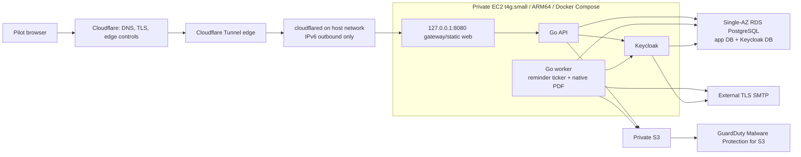

# AWS Single-AZ ARM64 Private-Pilot Production Preparation ExecPlan

This ExecPlan is a living document. Keep `Progress`, `Decision Log`,
`Discoveries`, and `Outcome` synchronized with actual work. Follow
[`docs/PLANS.md`](../../PLANS.md), the repository
[`AGENTS.md`](../../../AGENTS.md), and the literal evidence vocabulary in the
[`output contract`](../../agent-harness/output-contract.md).

## Status

- Plan status: `active` — Tasks 1–5 and the available Task 6 local gates are
  `verified locally`; the immutable mixed-workload capacity gate is `blocked`.
  The 2026-08-11 Task 8 runtime-simplification amendment has completed Layers
  8.0–8.5 local implementation and the available focused gates are
  `verified locally`. Sandbox-bound integration checks and native ARM64
  capacity remain `blocked` or `not run`; no superseded runtime result is
  inherited.
- Current result: the owner/runtime contract, production-only Compose, AWS
  adapters, offline IaC, and digest-bound release contracts are implemented.
  On 2026-08-11 the local architecture was revised to an outbound-only
  Cloudflare Tunnel over IPv6; ALB, NAT Gateway, public IPv4, public subnets,
  ACM origin TLS, and origin-auth secrets were removed.
  The repository remains `candidate-only` and release is `release pending`.
- Remote authority: on 2026-08-11 the user authorized Task 7 AWS/Cloudflare
  work. The AWS read-only discovery and current price/quota report are
  complete. A later authorized read-only follow-up reconfirmed the exact
  `avia` caller. The replacement scoped Cloudflare bearer is active; the exact
  account, active `aviasurveil.com` zone, and owner-selected
  `demo.aviasurveil.com` hostname are verified. Discovery also found that this
  hostname currently routes to the healthy `aviasurveil-demo-local` Tunnel and
  loopback port `8086`. The later exact plan-only authorization produced and
  reviewed one Terraform remote-state bootstrap plan with 8 additions, 0
  changes, and 0 destroys. The separately exact-authorized apply created and
  verified seven resources, then stopped `blocked` because the operator policy
  allowed alias prefix `avia-private-pilot-*` instead of the required
  `aviasurveil360-private-pilot-*`; `aws_kms_alias.state` was not created. The
  owner corrected the policy to v2, and a separately authorized residual plan
  was reviewed and exact-authorized at 1 addition, 0 changes, and 0 destroys.
  Its apply completed and the alias-to-key binding is verified; all eight
  bootstrap resources now exist. The exact-authorized S3 backend migration and
  native lockfile probe completed with zero resource changes.
  Publication, DNS/Tunnel, connector/runtime-secret changes, database
  migration, deployment, SMTP, data, smoke, recovery, traffic, rollback,
  retain/destroy, and residue actions remain `not run`.
- Next: separately authorize the next dependency-valid infrastructure plan;
  backend migration does not authorize it. Before any further provider plan,
  implement and requalify Task 8 locally so the desired runtime, release
  subjects, IAM/secrets, ECR, and capacity inputs no longer describe the
  superseded web, scheduler, data-feed, or Gotenberg roles.
  Production Tunnel creation must leave application DNS unmanaged; moving the
  existing hostname is a later separately authorized release/cutover wave.
- Result boundary: local completion can establish only `candidate-only`,
  `release pending`, and `production-ready: not established`.

## Objective

Prepare a cost-bounded AWS private-pilot production architecture for
AviaSurveil360 that runs the application on one ARM64 EC2 `t4g.small` host
using a dedicated production Docker Compose definition, while moving
authoritative PostgreSQL data to one private Single-AZ RDS instance, object
data to private S3, malware scanning to GuardDuty Malware Protection for S3,
and mail delivery to an external TLS SMTP provider.

The local implementation must make this topology deployable and verifiable
without silently turning the existing local Compose stack into a production
artifact. A later, separately authorized release action must still prove the
exact account, region, capacity, recovery, identity, operations, and legal
inputs before real pilot traffic.

## User-Visible Outcome

After the local preparation and later separately authorized deployment gates
are complete, a small set of approved pilot users can access the canonical
AviaSurveil360 workflow through a remotely managed Cloudflare Tunnel whose
connector makes outbound IPv6 connections from the sole EC2 host. The host has
no public IPv4 and accepts no security-group ingress. The environment remains
deliberately Single-AZ and does not claim high availability. Uploaded Evidence
remains private and is not reviewable or downloadable until the exact object
version has a clean managed malware-scan result. Generated reports remain
server-rendered and private.

## Relationship To Existing Plans

- This is the deployment-preparation successor required by the production
  release/operations gate in the
  [React Vite PWA And Go Offline-First Production Plan](2026-07-20-react-vite-pwa-go-offline-first-production-plan.md).
- It does not supersede the paused
  [AWS Preprod Validation Plan](2026-07-27-aws-preprod-validation-plan.md).
  Production cutover remains blocked until the applicable preprod and release
  gates are explicitly dispositioned.
- It does not supersede or expand the disposable
  [Cost-Optimized IPv6 ARM64 EC2 And Cloudflare Trial](2026-08-05-cost-optimized-ipv6-arm64-ec2-cloudflare-trial-plan.md).
  That trial remains a three-service, Tunnel-based, candidate-only demo. Its
  modules are not weakened or expanded; the production target uses its own
  focused Tunnel/dual-stack implementation and retains RDS/S3 production
  invariants.
- The existing `deploy/local/` stack remains the local development and
  integration harness. Production receives a separate definition and never
  inherits local database, MinIO, Mailpit, fixture, loader, or test services.

## Current Authorization Boundary

The user authorized repository planning and implementation for the local
preparation described in Tasks 1–6. This includes source, tests, production
Compose, local policy, Terraform/Terragrunt modules and fixtures, runbooks, and
documentation changes. A later authorization permitted the recorded AWS
read-only Task 7 discovery. On 2026-08-11 the user then separately authorized
only a provider-backed remote-state bootstrap plan with explicit `avia` and
`eu-central-1`, followed by exact authorization of that reviewed apply. The
apply created seven of eight resources and stopped on denied
`kms:CreateAlias`; it did not authorize IAM remediation or a changed residual
plan. Neither authorization turns the remaining list below into standing
authority.

The following remain separate explicit approvals:

1. read-only AWS/Cloudflare/provider discovery;
2. remote-state bootstrap apply or lock acquisition;
3. each real Terraform/Terragrunt plan;
4. each reviewed apply wave;
5. artifact publication and signing;
6. DNS, Cloudflare Tunnel, or connector-token changes;
7. secret and SMTP credential population;
8. database bootstrap and migrations against RDS;
9. pilot identity provisioning and any synthetic or real data load;
10. remote functional, security, load, failure, recovery, or restore test;
11. deployment, traffic routing, release, rollback, retention, destruction,
    or residue inspection.

Plan creation and local implementation never imply any of those authorities.

## Accepted Architecture Decisions

| Area | Accepted private-pilot value |
|---|---|
| Edge | One remotely managed Cloudflare Tunnel; the connector makes outbound-only IPv6 TCP/UDP 7844 connections and reaches the gateway only at `127.0.0.1:8080`. There is no ALB, AWS WAF, public origin, or direct-origin DNS route. Cloudflare edge controls and application rate limits remain required. |
| Availability | One workload AZ and one running application host. The environment is explicitly non-HA. A second AZ contains only the private subnet required by the RDS DB subnet group. Four Tunnel edge connections improve connector-edge continuity but do not make the sole host highly available. |
| Compute | Exactly one On-Demand ARM64 EC2 `t4g.small`; no amd64 image, emulation, ASG fleet, ECS, EKS, or Kubernetes. The selection uses the current time-limited T4g offer only after a fresh eligibility check; revisit the instance type only from measured capacity evidence. |
| Runtime | Raw Docker Engine plus a dedicated production Docker Compose definition. A host `systemd` unit owns Compose. A separate hardened `systemd`-owned, digest-bound ARM64 `cloudflared` container is the only host-network exception and is not part of production Compose. |
| Long-running containers | Exactly four production Compose roles: gateway with the embedded React/Vite static artifact, Go API, one Go worker that also schedules due reminders and renders PDFs, and Keycloak. Migration and database/identity bootstrap commands are bounded one-shot jobs. `cloudflared` remains separately supervised by systemd. |
| Production exclusions | PostgreSQL, Keycloak PostgreSQL, MinIO, Mailpit, ClamAV, local volume-init/tooling, seed, fixture, loader, backup-MinIO, Prometheus, Grafana, Loki, Tempo, and Alertmanager containers are absent from the production Compose definition. |
| Database | One encrypted private PostgreSQL RDS `db.t4g.micro`, Single-AZ, with two separate logical databases and least-privilege roles: `aviasurveil360`/application role and `keycloak`/Keycloak role. `db.t4g.small` is the first measured upgrade, not the starting size. |
| Object storage | Private S3 buckets with public-access block, TLS, versioning, encryption, bounded lifecycle, exact non-overwriting keys, and EC2 instance-role access. No MinIO production fallback and no long-lived S3 access keys. |
| Malware scanning | No ClamAV production container. Use standalone GuardDuty Malware Protection for S3 on untrusted upload bucket/prefixes. Only the exact `NO_THREATS_FOUND` object version may be promoted to canonical storage or marked `CLEAN`. |
| Email | External owner-approved TLS/STARTTLS SMTP. No SES and no Mailpit in production. API/worker and Keycloak use separately scoped credentials where the provider supports them. |
| PDF rendering | Native Go rendering inside the worker using a pinned pure-Go library and embedded checksum-pinned Noto Sans fonts. The renderer accepts only immutable report snapshots, produces deterministic metadata and bytes, and preserves the existing immutable document-version/outbox boundary. No Gotenberg or browser renderer remains in any runtime surface. |
| Egress | One egress-only Internet Gateway serves public IPv6; there is no NAT Gateway, ordinary Internet Gateway, IPv4 default route, EIP, or public subnet. One S3 Gateway Endpoint serves private IPv4 EC2-to-S3 traffic. Do not add an interface-endpoint fleet without measured cost/security justification. |
| Registry | Exactly five ECR repositories: `cloudflared`, `gateway`, `application` for API/worker/migration, `keycloak`, and `database-bootstrap`. Seven release subjects map to those repositories and remain target-account, `linux/arm64`, and digest-only. |
| Secrets | Exactly eight empty runtime Secrets Manager containers: application database, migration database, Keycloak database, OIDC client, session encryption, Keycloak service client, application SMTP, and Keycloak SMTP. The RDS-managed bootstrap secret is separate. The Cloudflare connector token is one separate Standard KMS-encrypted SSM SecureString whose Terraform value is a non-runnable write-only placeholder; the real token is populated only by a separate authorized action and never enters Terraform state. |
| Observability | Exactly seven CloudWatch log groups: host, `cloudflared`, gateway, API, worker, Keycloak, and VPC flow. Structured logs plus host/container metrics use bounded retention. A one-minute check publishes `CloudflaredTunnelHAConnections`; missing or fewer than four connections is breaching. The local LGTM stack is not copied to production. |
| Recovery target | Initial engineering targets are RPO <= 15 minutes and RTO <= 4 hours for the private pilot, subject to measured restore evidence and owner acceptance. RDS PITR starts at 14 days, AWS Backup recovery points at 35 days, and CloudWatch logs at 30 days. These are operational defaults, not legal retention or legal-hold policy. |
| Records boundary | No automatic Evidence/configuration/audit-history deletion. Legal hold, regulatory retention, disposition, and deletion authority remain blocked owner decisions. |

## Private Dual-Stack Network Skeleton

The product workload remains Single-AZ. Only the RDS DB subnet group imposes a
two-AZ subnet requirement:

- An RDS DB subnet group must contain subnets in at least two Availability
  Zones. See the AWS
  [`CreateDBSubnetGroup` contract](https://docs.aws.amazon.com/AmazonRDS/latest/APIReference/API_CreateDBSubnetGroup.html).

Therefore the accepted VPC shape is:

```text
VPC
├── Availability Zone A
│   ├── private-dual-stack-app-a -> one t4g.small EC2, private IPv4 + global IPv6
│   ├── private-db-a         -> Single-AZ RDS placement candidate
└── Availability Zone B
    └── private-db-b         -> RDS subnet-group requirement only
```

The application route table has only an IPv6 `::/0` route to one egress-only
Internet Gateway plus the private IPv4 S3 Gateway Endpoint route. It has no
IPv4 default route. There is no normal Internet Gateway, NAT Gateway, EIP,
public subnet, second EC2 target, RDS standby, or implied HA claim.

## Target Runtime And Trust Boundaries



### Edge And Tunnel Lock

- Cloudflare is the only intended public client path.
- The EC2 security group has zero ingress rules and the gateway publishes only
  fixed loopback `127.0.0.1:8080`; there is no network-reachable public origin.
- A remotely managed Tunnel maps the exact hostname to that loopback service
  and ends with a catch-all `http_status:404` rule. Wrong-host requests fail
  closed at the gateway as an additional boundary.
- `cloudflared` uses reviewed Cloudflare IPv6 ranges on TCP/UDP 7844 and is
  pinned to edge IP version 6. No IPv4 or NAT fallback exists.
- Terraform creates only an unusable `PENDING_SEPARATE_AUTHORIZATION`
  SecureString value through the write-only provider field. Runtime refuses
  that placeholder. A separate exact authorization must populate the real
  token; the token must never appear in plan, state, logs, evidence, or a
  command line.
- Keycloak public login endpoints are routed deliberately; Keycloak admin and
  management endpoints are not publicly routed.
- Database, worker, Docker API, metrics, and management
  endpoints have no public listener.

### Production Compose Contract

- Create a distinct production surface such as `deploy/aws-private-pilot/`.
  Do not make production depend on choosing the correct profile inside
  `deploy/local/compose.yaml`.
- Pin every image by immutable digest and require a `linux/arm64` manifest.
- Build application images outside the EC2 host and pull exact subjects from
  ECR only after a separately authorized publication action.
- Use non-root users, `no-new-privileges`, dropped capabilities, bounded PIDs,
  explicit CPU/memory limits, health checks, restart policies, and the smallest
  writable filesystems/temporary mounts each service needs.
- Publish only the gateway target port to the host. All other ports remain on
  internal Compose networks.
- Bind that gateway port literally to `127.0.0.1:8080`. Run the digest-bound
  ARM64 connector separately under systemd with host networking solely so it
  can reach loopback and expose its metrics at `127.0.0.1:2000`; never add it
  to the production Compose role list or mount the Docker socket.
- Never mount the Docker socket into an application container.
- Runtime secrets are fetched through the instance role and exposed through
  root-owned runtime files or Docker secrets. Secret values never appear in
  Git, image layers, Compose YAML, user data, Terraform inputs/state where
  avoidable, logs, command lines, or evidence.
- The host CloudWatch Agent and SSM Agent may run natively. Application and
  Keycloak remain containerized.
- Docker Compose itself is supervised by a hardened `systemd` unit with
  explicit startup, graceful shutdown, health verification, and rollback
  behavior.

Docker documents single-host production Compose and recommends a separate
production configuration surface. See
[Docker Compose in production](https://docs.docker.com/compose/how-tos/production/).

### RDS Contract

- Start with one `db.t4g.micro` PostgreSQL instance in one AZ, encrypted and
  not publicly accessible.
- Create `aviasurveil360` and `keycloak` as separate databases with separate
  non-owner runtime roles. Neither role can connect to or modify the other's
  database.
- A bounded bootstrap/migration identity creates databases/roles and applies
  application migrations. It is not retained by normal runtime containers.
- Application migrations never modify Keycloak-owned tables. Keycloak owns
  its database schema lifecycle.
- The shared instance is an explicitly accepted cost optimization and shared
  failure/recovery boundary. Backup and restore evidence must prove both
  logical databases from one coordinated recovery point.
- Connection-pool totals across API, the consolidated worker, and Keycloak
  must fit `db.t4g.micro`; fail the capacity gate rather than silently
  increasing pool limits.
- Upgrade to `db.t4g.small` only when observed CPU, free memory, connection,
  I/O, or latency thresholds justify it.

### S3 And Malware-Scan Contract

- The browser uploads only to private, non-overwriting quarantine keys through
  short-lived presigned HTTPS URLs.
- The EC2 application uses the AWS SDK credential-provider chain and instance
  profile. Production static S3 access key/secret pairs are forbidden.
- Protect each untrusted upload bucket or selected prefix with standalone
  GuardDuty Malware Protection for S3 and enable result tagging.
- The first private-pilot integration may reuse the PostgreSQL outbox and have
  the worker poll exact-version S3 tags through the S3 Gateway Endpoint. It
  does not require Lambda, SQS, or an interface endpoint in the first slice.
- Bind every result to bucket, key, S3 version ID, ETag, registered SHA-256,
  and expected size. At-least-once/duplicate result processing is idempotent.
- `NO_THREATS_FOUND` permits exact-version copy/promotion and the existing
  `CLEAN` transition. `THREATS_FOUND` remains quarantined.
  `UNSUPPORTED`, `ACCESS_DENIED`, `FAILED`, missing, stale, mismatched, or
  timed-out results remain non-reviewable and non-downloadable with an
  operator-visible failure state.
- Bucket policy denies ordinary principals access to unscanned or non-clean
  objects and prevents uploader-controlled mutation of the GuardDuty result
  tag.
- Keep the current clean-only Evidence invariant. Removing the ClamAV product
  does not remove malware scanning.

AWS documents that Malware Protection for S3 can run independently, publishes
results through EventBridge and optional object tags, and supports tag-based
access control. See
[how Malware Protection for S3 works](https://docs.aws.amazon.com/guardduty/latest/ug/how-malware-protection-for-s3-gdu-works.html)
and
[tag-based S3 access control](https://docs.aws.amazon.com/guardduty/latest/ug/tag-based-access-s3-malware-protection.html).

### SMTP Contract

- Mailpit is local-only and absent from production.
- The owner must supply the exact SMTP provider/relay, hostname, port,
  TLS/STARTTLS mode, sender identities, authentication mechanism, quotas,
  bounce/rejection behavior, rotation owner, and incident contact before
  remote deployment.
- The application sender and Keycloak must support the selected encrypted
  transport and fail closed on invalid certificates or an unencrypted public
  route.
- Production secrets are separately scoped where supported. The application
  cannot use Keycloak administration credentials and Keycloak cannot use the
  application's database or S3 role.
- SES is deliberately excluded unless a future owner decision changes this
  plan.

### Capacity Contract

`t4g.small` has a tight memory budget. Removing local PostgreSQL, MinIO,
Mailpit, the LGTM stack, and ClamAV makes the target plausible but does not
prove it fits. Task 8 removes Chromium and three standalone runtime roles, but
Keycloak's JVM and the consolidated worker's mixed reminder/PDF workload still
require measurement rather than an inferred pass.

The current AWS offer documents up to 750 aggregate `t4g.small` instance
hours per month through 31 December 2026. It is an eligibility input, not a
zero-bill claim: RDS, EBS, KMS, secrets, S3, GuardDuty usage, ECR, CloudWatch,
Backup, data transfer, external SMTP/Cloudflare plans, and surplus CPU credits
remain separately billable. Re-check the official
[EC2 T4g information](https://aws.amazon.com/ec2/instance-types/t4/) before
every cost-bearing plan.

The 2026-08-11 Tunnel revision removes USD 68.62/month of ALB, NAT Gateway,
and three public IPv4 fixed charges plus USD 0.80/month for two retired
origin-auth secrets. At the discovered Frankfurt list rates and the module's
storage bounds, the revised expected fixed range is **USD 26.91–40.69/month**
while the owner-attested T4g allowance applies through 31 December 2026. The
post-offer comparator is **USD 40.93–54.71/month**. S3, GuardDuty, ECR,
CloudWatch logs, AWS Backup, data transfer, requests, SMTP, Cloudflare plan,
and surplus CPU credits remain usage-dependent and additional.

Local ARM64 and later EC2 acceptance must record:

- steady-state host and per-container RSS/cgroup memory;
- API/worker/Keycloak CPU, latency, and restart behavior;
- one bounded native PDF render, one reminder scheduling cycle, one scan-result
  promotion, email delivery, normal OIDC login, and the canonical pilot
  workflow;
- zero kernel OOM event and zero unexpected container restart;
- no sustained swap dependency; swap activity cannot manufacture a capacity
  pass;
- at least 15% host memory headroom after the bounded mixed-workload run;
- root/EBS use below 70% after image pull and log rotation;
- bounded JVM heap, Go connection pools, native render concurrency, Docker log
  rotation, and PID limits; and
- CPU-credit balance and surplus-credit cost under the approved workload.

Failure produces a literal `NO-GO for t4g.small`. It does not silently resize,
remove required runtime roles, disable the scan gate, or weaken health checks.

## Scope

- Freeze owner decisions and a machine-verifiable architecture contract.
- Add a distinct production Compose/runtime surface with no local
  infrastructure services.
- Add AWS-native S3 credential-provider and exact-version behavior.
- Replace production ClamAV coupling with GuardDuty S3 scan-result processing
  while keeping local ClamAV integration available to local profiles.
- Add production-safe TLS/STARTTLS SMTP support and tests.
- Compose focused Terraform/Terragrunt infrastructure for the accepted VPC,
  egress-only IPv6/Tunnel, EC2, RDS, S3, GuardDuty, ECR, IAM/secrets,
  CloudWatch, backup, and budget boundaries.
- Add deployment, migration, health, capacity, recovery, and rollback command
  contracts that can be verified locally without contacting AWS.
- Simplify the demo/production runtime to gateway, API, consolidated worker,
  and Keycloak; keep the root legacy demo as its existing behavior oracle.
- Replace the external Chromium document dependency with deterministic native
  Go report rendering while preserving immutable report and Evidence identity.
- Produce local evidence and an exact next-action handoff.

## Explicit Exclusions

- Any real AWS, Cloudflare, DNS, certificate, SMTP, registry, or production
  mutation in Tasks 1–6.
- Production traffic, real pilot users/data, customer identity federation,
  and regulatory release approval.
- ALB, NAT Gateway, ordinary Internet Gateway, EIP, public subnet, public IPv4,
  ACM origin certificate, origin-auth header secrets, Multi-AZ
  application/runtime, Multi-AZ RDS, a second EC2 instance, autoscaling, ECS,
  EKS, Kubernetes, AWS WAF, SES, or an interface VPC endpoint fleet.
- Running PostgreSQL, MinIO, Mailpit, or ClamAV in the production Compose
  definition.
- Native/systemd installation of API, worker, or Keycloak.
- A production/demo data-feed worker, separate reminder scheduler, separate
  web container, Gotenberg, Chromium, or another remote document renderer.
- Deleting the dormant AviaCore integration domain in this amendment; its
  source disposition is a separate decision after runtime references are gone.
- Treating S3 versioning as a complete backup, Single-AZ as HA, a local ARM64
  run as EC2 capacity proof, or a successful Terraform fixture as deployment
  evidence.
- Automatic retention deletion, legal disposition, legal-hold release, or
  destructive cleanup of append-only product history.
- Commit, push, pull request, branch, deployment, or external-system changes
  unless separately authorized.

## Entry Gates

Local Tasks 1–6 may begin now. Before any remote action, all of the following
must be satisfied or explicitly dispositioned by their owners:

- exact AWS account, region/data residency, availability zone, domain,
  Cloudflare zone/account/Tunnel name, scoped connector-token authority, and
  approved caller;
- exact source revision/tree digest, ARM64 OCI subjects, SBOMs, provenance,
  vulnerability results, migrations, and rollback predecessor;
- current Keycloak vulnerability disposition with no expired exception used
  to manufacture a pass;
- exact SMTP provider and encrypted transport proof;
- pilot user/organization identity, MFA, device/browser, and support policy;
- preprod/stakeholder and production release-authority disposition;
- backup, PITR, object recovery, RPO/RTO, alert/on-call, retention, legal hold,
  deletion, and incident owners;
- monthly and one-run cost ceilings, T4g offer eligibility/current pricing,
  budget alerts, release window, rollback owner, and expiry/retain decision;
  and
- an exact separate authorization for the next remote action only.

## Repository Orientation And Affected Interfaces

- `deploy/local/compose.yaml`: retained local harness; production must not
  reuse its infrastructure services.
- `deploy/aws-private-pilot/`: new production Compose, gateway, systemd, and
  runtime policy surface.
- `apps/api/internal/platform/objectstore/`: current MinIO-compatible adapter
  requires static credentials and must gain AWS provider-chain/exact-version
  behavior without weakening local MinIO tests.
- `apps/api/internal/platform/scanner/` and
  `apps/api/internal/worker/evidence/`: current production path requires
  ClamAV and streams object bytes; add a managed-result boundary while keeping
  clean-only transitions and idempotent outbox semantics.
- `apps/api/internal/notifications/smtp_sender.go`: add the selected secure
  SMTP modes and certificate verification.
- `apps/api/internal/platform/config/` and command entrypoints: define one
  fail-closed AWS private-pilot profile and prohibit local fallback.
- `infra/terraform/modules/` and `infra/terragrunt/`: reuse accepted modules
  where their invariants fit; add focused modules/environment composition
  rather than weakening the disposable IPv6 trial.
- `docs/operations/` and `tests/`: decision, topology, runbook, policy, and
  evidence contracts.

## Ordered Work

### Task 1 — Freeze Decisions And Architecture Contracts

**Files**

- Create `docs/operations/AWS_PRIVATE_PILOT_DECISIONS.md`.
- Create `docs/operations/AWS_PRIVATE_PILOT_RUNTIME.md`.
- Create `tests/aws-private-pilot-decision-contract.test.mjs`.
- Create `scripts/check-aws-private-pilot-decisions.sh`.
- Update this plan, the plan index, and tracker only with observed results.

**Work**

- Encode every accepted decision in this plan and every unresolved owner input
  from the Entry Gates.
- Fail on missing account/region/domain/SMTP/retention/cost/release inputs,
  expired T4g evidence, Multi-AZ or second-host claims, amd64/emulation, local
  infrastructure containers, WAF/SES/interface-endpoint creep, static S3
  credentials, absent scan gate, public data services, ALB/NAT/public IPv4,
  connector tokens in Terraform state, or remote authority.
- Record exact service/resource ownership, secret references, ports, health,
  IAM, network, capacity, backup, and rollback requirements.
- Perform no provider initialization or remote call.

**Verification**

```bash
node --test tests/aws-private-pilot-decision-contract.test.mjs
./scripts/check-aws-private-pilot-decisions.sh
```

Expected: the committed example remains non-deployable and reports exact
missing-owner inputs; contradictory or unsafe fixtures fail without contacting
AWS, Cloudflare, or SMTP.

### Task 2 — Build The Dedicated Production Compose Surface

> Historical implementation record. Task 8 supersedes this task's runtime
> inventory and Gotenberg requirement. Do not use the role list below as the
> implementation target for current work.

**Files**

- Create `deploy/aws-private-pilot/compose.yaml`.
- Create `deploy/aws-private-pilot/gateway/` configuration.
- Create a hardened `systemd` unit/template and runtime bootstrap contract.
- Create separate hardened connector and one-minute Tunnel-health systemd
  units without adding `cloudflared` to Compose.
- Create `deploy/aws-private-pilot/image-lock.json`.
- Create `tests/aws-private-pilot-compose-contract.test.mjs`.
- Create `scripts/test-aws-private-pilot-compose.sh`.

**Work**

- Model only approved runtime roles and bounded one-shot migration/bootstrap
  jobs.
- Require external RDS, S3, GuardDuty-result, SMTP, OIDC/Keycloak, secret, and
  telemetry inputs.
- Prohibit all local infrastructure/tooling containers, local data volumes,
  host-published internal ports, mutable image tags, amd64, emulation,
  privileged mode, Docker-socket mounts, and secret literals.
- Pin ARM64 images/digests, internal networks, health checks, limits, shutdown,
  log rotation, and restart behavior.
- Bind the sole gateway host port to `127.0.0.1:8080`; supervise the
  digest-bound ARM64 `cloudflared` container separately with the only approved
  host-network exception, no Docker socket, and a four-connection health gate.
- Use the Chromium-only Gotenberg image unless a reviewed product requirement
  proves office conversion is needed.
- Keep local Compose behavior unchanged except for shared build artifacts that
  are intentionally reused and verified.

**Verification**

```bash
node --test tests/aws-private-pilot-compose-contract.test.mjs
docker compose -f deploy/aws-private-pilot/compose.yaml config
./scripts/test-aws-private-pilot-compose.sh static
```

Expected: production config contains no local infrastructure service and fails
closed on missing external inputs. No external service is contacted.

### Task 3 — Implement AWS Storage, Managed Scan, And Secure SMTP Adapters

**Work**

- Refactor object storage so production uses the AWS credential-provider chain
  and instance profile; keep local MinIO static credentials explicitly local.
- Add version-aware open/tag/copy operations and exact-result identity.
- Add a GuardDuty S3 result provider that maps only exact-version
  `NO_THREATS_FOUND` to the existing clean promotion. Preserve retry, lease,
  crash-window, duplicate-delivery, quarantine, audit, and operator-failure
  semantics.
- Make the AWS production profile require managed scanning. Keep deterministic
  scanning test-only and ClamAV local-only.
- Add TLS/STARTTLS SMTP with certificate and hostname verification, bounded
  timeouts, redacted errors, and no plaintext public fallback.
- Add configuration and integration tests for missing/mismatched/stale scan
  results, tag tampering, failed TLS, wrong certificate, and local/production
  profile separation.

**Verification**

```bash
go -C apps/api test -race -count=1 ./internal/platform/objectstore/... \
  ./internal/platform/scanner/... ./internal/worker/evidence/... \
  ./internal/notifications/... ./internal/platform/config/...
go -C apps/api test -race -count=1 ./cmd/api ./cmd/worker
```

Expected: local MinIO/ClamAV/Mailpit contracts remain green where applicable;
the AWS profile cannot start with static S3 credentials, absent managed scan,
or insecure external SMTP.

### Task 4 — Compose The Cost-Bounded AWS Infrastructure Locally

**Files**

- Add focused Terraform changes/modules only for proven gaps.
- Create `infra/terragrunt/environments/aws-private-pilot/` with no committed
  account, region, domain, or secret defaults.
- Extend OPA/cost/security mutation fixtures.
- Create `tests/aws-private-pilot-infrastructure-contract.test.mjs`.
- Create `scripts/check-aws-private-pilot-infrastructure.sh`.

**Work**

- Model one private dual-stack workload subnet in AZ A, one egress-only
  Internet Gateway, zero runtime ingress, zero public subnet/IPv4/NAT/ALB,
  two private RDS subnets in AZ A/B, one S3 Gateway Endpoint, one Single-AZ RDS
  instance with two logical database bootstrap contracts, a remotely managed
  Cloudflare Tunnel, write-only-placeholder SSM connector parameter, private
  S3, GuardDuty Malware Protection plans/tags, ECR, IAM/secrets, CloudWatch,
  AWS Backup, and Budget.
- Ensure the EC2 role can use only required S3/KMS/monitoring/secret actions and
  does not receive database-owner or broad wildcard authority.
- Ensure GuardDuty has only the required protected-bucket/tag permissions.
- Keep database and buckets private, encryption and versioning enabled, and
  destructive lifecycle changes guarded.
- Deny second compute, autoscaling, Multi-AZ RDS, any NAT/ALB/ordinary IGW/EIP,
  WAF, SES, interface endpoint fleet, public IPv4 on EC2, public RDS/S3, static
  S3 keys, connector-token data sources, amd64, mutable images, missing budgets,
  and unbounded retention unless a new reviewed decision changes this plan.
- Use mocked/local outputs only for offline fixtures. A mock can never produce
  an apply-approved plan.

**Verification**

```bash
terraform -chdir=infra/terraform fmt -check -recursive
terraform -chdir=infra/terraform test
terragrunt hcl fmt --check
node --test tests/aws-private-pilot-infrastructure-contract.test.mjs
./scripts/check-aws-private-pilot-infrastructure.sh
```

Run TFLint, Trivy, and OPA when their pinned local binaries are available.
Provider downloads or remote backend access remain `not run` unless separately
authorized.

### Task 5 — Add Deployment, Migration, Health, And Rollback Contracts

> Historical implementation record. Task 8 supersedes this task's
> scheduler/data-feed/Gotenberg dependency language and release-subject set.

**Work**

- Add local command contracts for ARM64 build/export, digest verification,
  production configuration rendering, database bootstrap/migration, Compose
  start/health/drain, and application rollback/roll-forward.
- Bind every runtime release to source tree, OCI manifest, image config,
  migration, Compose, gateway, decision, and policy digests.
- Apply application migrations before traffic. Bootstrap the two logical RDS
  databases/roles with a bounded identity and then remove that authority from
  normal runtime.
- Prove Keycloak readiness before API login traffic and prove API/worker/
  scheduler/data-feed/Gotenberg dependency semantics.
- Model connector-token rotation and rollback as a separate SSM write that
  never exposes a direct origin or places the token in Terraform state.
- Treat forward-only database migration truth explicitly: binary rollback is
  allowed only when N/N-1 compatibility passes; otherwise use roll-forward or
  coordinated restore.
- Contract-test exact scoped retain/destroy inputs, but do not execute them.

**Verification**

Run the focused command-contract tests created by the implementation and the
repository's existing artifact, migration, runbook, and rollback contracts.
Expected: every command supports dry-run/offline validation and rejects a
changed subject, stale input, unresolved target, or remote action without an
exact authorization bundle.

### Task 6 — Prove The Local Candidate And Record Evidence

> Historical verification record. Task 8 supersedes the Gotenberg render and
> pre-amendment capacity topology below. Preserve its evidence bytes, but do
> not inherit its pass results for the simplified runtime.

**Work**

- Run the smallest applicable Go, React, OpenAPI, Compose, infrastructure,
  image/SBOM, migration, upload/scan, notification, document, recovery,
  runbook, and documentation gates.
- On native ARM64, run the production container set against task-owned test
  doubles/external harness dependencies without adding those dependencies to
  the production Compose file.
- Run a bounded mixed workload and record per-service memory, CPU, restarts,
  health, disk, connection pools, Gotenberg render behavior, and headroom.
- Preserve local profile parity and verify PostgreSQL, MinIO, Mailpit, and
  ClamAV remain local-only.
- Create a local evidence document only from fresh observed results. Label all
  AWS/Cloudflare/SMTP/deployment/cutover/recovery evidence `not run`.
- Reconcile this plan, index, tracker, affected runbooks, and evidence.

**Acceptance**

- The local production-preparation result may become
  `ready-for-verification` only when all required local gates pass and every
  remote requirement is explicitly retained as `not run` or `blocked`.
- It remains `candidate-only`, `release pending`, and
  `production-ready: not established`.

### Task 7 — Separately Authorize And Execute Remote Waves

The first separately authorized Task 7 read-only AWS discovery wave completed
on 2026-08-11. A later authorized read-only follow-up reconfirmed the exact
`avia` caller. An initial Cloudflare bearer-shaped value failed verification;
the owner replaced it, and the new scoped bearer verified `active`. Read-only
zone, DNS, Tunnel, and Tunnel-configuration calls resolved the exact account,
active `aviasurveil.com` zone, selected `demo.aviasurveil.com` hostname, and
its currently healthy local-demo Tunnel. No token value was logged and neither
wave mutated resources. The user then authorized only the remote-state
bootstrap provider plan with `avia` in `eu-central-1`. Terraform 1.15.6 with
AWS provider 6.58.0 produced a protected reviewed bundle containing 8
additions, 0 changes, and 0 destroys. The user then supplied the exact apply
authorization. Seven resources were created and verified, while
`aws_kms_alias.state` failed `blocked` on the existing IAM alias-prefix
mismatch. The partial local state is preserved mode `0600`; no remote backend
or state lock was used. After the owner corrected the alias ARN in policy v2,
the separately authorized residual plan produced exactly one alias addition,
zero changes, and zero destroys. Its subsequent exact-authorized apply
completed at 1 add/0 change/0 destroy, and the alias was verified against the
expected key. The subsequently exact-authorized backend migration moved the
eight-resource state to its versioned KMS-encrypted S3 key; a refresh-disabled
0/0/0 probe verified native `.tflock` create/delete behavior. For each future
remote wave:

1. refresh only the separately authorized read-only discovery and current
   price/quota facts needed by that wave;
2. generate and review one dependency-valid real plan wave from current real
   upstream outputs;
3. obtain a new authorization for that exact binary/JSON plan and apply only
   that wave;
4. stop before publication, secret population, migrations, identity/data,
   smoke, capacity, recovery, release, traffic, rollback, retain/destroy, and
   residue actions; and
5. require a separate current authorization for each next action.

No local implementation result can skip preprod, release authority, production
security/records approval, measured EC2/RDS capacity, backup/restore, or pilot
support gates.

### Task 8 — Runtime Simplification Amendment

This amendment was accepted on 2026-08-11 after Tasks 1–6 had accumulated
local evidence and Task 7 had completed only the recorded remote-state work.
It supersedes the runtime-role portions of Tasks 2, 5, and 6 without rewriting
their historical evidence. At amendment entry, every implementation and
verification item below is `not run`. No AWS, Cloudflare, SMTP, DNS, registry,
remote-state, provider-plan, apply, deployment, data, or traffic action is part
of this task. The requested `gpt-5.6-sol` max review and ultra recheck returned
a plan-review `NO-GO`; the xhigh synthesis resolved their findings in the
layers below. This is not a capacity `NO-GO for t4g.small`.

The implementation must proceed in the following working layers. Each layer
must leave the repository buildable, run its focused gates, and update this
plan with observed results before the next layer begins.

#### Layer 8.0 — Freeze The Simplified Runtime Inventory

**Work**

- Record the only production long-running Compose roles as `gateway`, `api`,
  `worker`, and `keycloak`; retain `cloudflared` as a separate systemd-owned
  connector and retain only bounded database-bootstrap, migration, and
  Keycloak-bootstrap jobs.
- Generate one immutable, hash-bound legacy inventory and one separately
  hash-bound final-target inventory with the same schema. Both contain sorted
  runtime roles, executable commands, Docker targets, Compose/systemd/
  supervisor roles, health checks, release subjects, image locks, ECR
  repositories, Secrets Manager containers, IAM grants, IPv6 egress/preflight,
  log groups, cost inputs, source paths, per-file SHA-256 values, and one
  canonical aggregate SHA-256.
- Record the exact named delta owned by each of Layers 8.1–8.5. Each layer test
  must reduce only its declared delta and reject unrelated drift. Never rewrite
  the legacy inventory or its digest to make a target assertion pass; Layer
  8.5 alone requires the complete target delta to reach zero.
- Preserve Keycloak and the API's standard OIDC issuer/JWKS contract. A future
  Go-auth ZIP cannot replace Keycloak until issuer/provider, signing-key
  rotation, sessions/revocation, MFA/recovery, password/reset, audit, and
  organization/role isolation are independently qualified.
- Preserve local MinIO/ClamAV/Mailpit integration coverage. ClamAV remains
  local-only; production exact-version GuardDuty fail-closed behavior is
  unchanged.
- Classify the AviaCore/data-feed domain implementation as dormant source.
  Removing that domain source is explicitly outside this amendment; no runtime
  command, image, service, secret, health, supervisor, or egress dependency may
  remain merely to preserve it.

**Focused verification**

```bash
node --test tests/aws-private-pilot-decision-contract.test.mjs \
  tests/aws-private-pilot-compose-contract.test.mjs \
  tests/aws-private-pilot-infrastructure-contract.test.mjs \
  tests/aws-private-pilot-release-contract.test.mjs \
  tests/aws-private-pilot-runtime-inventory-contract.test.mjs
```

Expected: the current superseded state and final target are separate immutable
inventories with a reviewable named delta. Capturing the legacy baseline does
not require the unimplemented target to pass prematurely.

**Observed 2026-08-11 — `verified locally`**

`runtime-inventory-legacy.json` remains immutable with canonical aggregate
`sha256:e1e26c6d4050c3eaf57e1b6352bd1a3cbc4462d83c94a2c83d04be66d4d6351e`.
The final target is `runtime-inventory-target.json` with canonical aggregate
`sha256:77ee4da38a9a5ca9260a7d90e554f41f05cb20c67ae54d30e43ca88d430605b9`.
The target has 4 long-running roles, 7 release subjects, 5 ECR repositories,
8 runtime secret containers, and 7 log groups. The named 8.1–8.5 deltas are
present in both inventories and the stdout/hash contract matches the checked-in
target.

#### Layer 8.1 — Remove The Data-Feed Runtime Surface

**Work**

- Remove `DataFeedWriter`, `ErrDataFeedNotConfigured`, transition-owned
  data-feed event collections, data-feed event construction, API writer
  setup/readiness, and every `AVIA_DATA_FEED_*` runtime configuration or start
  guard. `MaterializeInspection` and `StartInspection` must no longer create or
  query `datafeed_events`, derive causation from them, require data-feed
  correlation, or emit new data-feed rows.
- Delete the `data-feed-worker`, `data-feed-backfill`, `data-feed-replay`, and
  `data-feed-reconcile` executable commands plus every Docker target,
  production/demo/local-preprod/quick-Tunnel Compose or operator route,
  entrypoint, supervisor, health, systemd, release-manifest, image-lock, ECR,
  secret, IAM, IPv6 destination, preflight, telemetry, runbook, and cost
  reference.
- Remove the five runtime trust/key file requirements and the two dedicated
  Secrets Manager containers from the private-pilot desired state. Do not
  issue a provider plan or infer deletion authority for any remote resource.
- Preserve existing `datafeed_*` tables, immutable triggers, migrations, and
  historical rows without destructive rewriting. Keep internal data-feed
  packages and tests only when unreachable from API/worker binaries and when
  they require no environment, writer, table precondition, secret, network,
  IAM, or operator surface. Record a separate source deletion decision in the
  tracker rather than adding compatibility wiring.

**Focused verification**

```bash
go -C apps/api test -race -count=1 ./internal/datafeed/... \
  ./internal/aviacorecontract/... ./internal/platform/config/... \
  ./internal/application/... ./cmd/api ./cmd/worker
go -C apps/api test -count=1 ./tests/integration \
  -run 'MaterializeInspection|StartInspection|DataFeedRetirement'
node --test tests/aws-private-pilot-*.test.mjs
docker compose -f deploy/aws-private-pilot/compose.yaml config
```

Expected: materialization and Inspector start succeed with no data-feed
environment, writer, table precondition, or egress; before/after row counts for
every `datafeed_*` table are identical. Dependency-graph and binary/string
scans prove API/worker runtime reachability is zero while preserved historical
tables and dormant package tests remain intact.

**Observed 2026-08-11 — `verified locally` / `blocked`**

The API/application lifecycle and private-pilot runtime surfaces no longer
construct, query, configure, or start a data-feed writer. Commands, Docker
targets, health/supervisor/IaC/release/egress surfaces, and trust inputs were
removed; dormant packages, migrations, triggers, and rows remain. Source-level
focused checks pass in a disposable Go copy. IPv6 data-feed tests are
`blocked` by the sandbox `[::1]:0` listener restriction, AviaCore fixture tests
are `blocked` by the unavailable external fixture, and database row-count
integration is `not run`.

#### Layer 8.2 — Merge Reminder Scheduling Into The Worker

**Work**

- Delete the standalone scheduler command, Docker target, Compose service,
  entrypoint loop, health marker, image/release subject, supervisor/systemd
  role, and scheduler-only configuration.
- Run `ScheduleDueReminders` in one separately supervised worker-owned
  controller goroutine, not as another case in the existing serial processor
  ticker. Run one startup cycle and then injected approximately 60-second
  ticks. A synchronous single-flight controller coalesces ticks and guarantees
  no overlap.
- Give every cycle a fixed deadline, deterministic keyset order such as
  `(rule_id, finding_id)`, a fixed batch size, and bounded pages. Isolate a
  candidate's transaction error, continue eligible independent candidates,
  and emit only redacted aggregate success/duplicate/retryable-failure and
  last-success/error telemetry.
- Keep each scheduling cycle independent from identity, notification, object
  check, Evidence, and document processing. Log and meter a scheduler error in
  redacted form, then continue all other worker functions and later reminder
  ticks; do not exit or mark the entire worker unhealthy for a recoverable
  scheduler failure.
- Preserve the existing per-reminder transaction, PostgreSQL transaction-level
  advisory lock, uniqueness constraint, and idempotent notification/audit
  writes. Retry truth is explicit: an unsuccessfully scheduled candidate is
  eligible again on a later reminder tick; downstream notification delivery
  alone retains its existing persisted lease/retry/crash-recovery behavior.
  Do not invent a scheduler lease or add an in-memory-only correctness
  dependency.
- On root cancellation, stop tick production, cancel the active scheduler
  cycle, and wait for both scheduler and processor goroutines with a
  `WaitGroup`. A recoverable scheduler timeout/error neither exits nor globally
  marks the worker unhealthy.
- Add injectable clock/tick and scheduler boundaries so unit tests prove
  startup, periodic execution, deterministic batching/pagination, cancellation,
  a hung-cycle deadline, no overlap, shutdown without goroutine leaks,
  poison-candidate/database failure isolation, duplicate suppression, later-
  tick scheduling retry, and independent notification lease retry without
  sleeping for real minutes.

**Focused verification**

```bash
go -C apps/api test -race -count=1 ./cmd/worker ./internal/application/... \
  ./internal/worker/...
go -C apps/api test -count=1 ./tests/integration -run 'Reminder|Worker'
node --test tests/aws-private-pilot-compose-contract.test.mjs \
  tests/aws-private-pilot-release-contract.test.mjs
```

Expected: one worker-owned controller owns reminder cadence without overlap;
other processors continue while reminder scheduling is blocked or failing,
independent candidates continue after one candidate fails, and a later tick
recovers idempotently.

**Observed 2026-08-11 — `verified locally`**

The worker controller tests pass with race detection. Startup, injected ticks,
single-flight/no-overlap, deadline cancellation, per-candidate isolation,
redacted telemetry, later-tick retry, and coordinated WaitGroup shutdown are
covered. Database-backed reminder/notification integration is `not run`.

#### Layer 8.3 — Merge The React Artifact Into The Gateway

**Work**

- Build the React/Vite HTTP artifact in the gateway's multi-stage Docker build
  and copy only the final static files into the non-root Caddy runtime image.
  Remove the web-server binary/container, web image/repository/release subject,
  service health/dependency, and inter-container proxy hop from both applicable
  HTTP-profile/demo Compose surfaces and the private-pilot surface. The root
  legacy demo remains unchanged.
- Apply static `GET`/`HEAD` and method rejection only after all proxy/denial
  routes. Preserve API/auth `POST`, `PUT`, `PATCH`, `DELETE`, and required
  `OPTIONS`; static handling must never intercept them. Use one executable
  precedence/status/method/cache matrix across production, local demo/full,
  local-preprod, and quick-Tunnel Caddy surfaces:

| Surface | Required behavior |
|---|---|
| Wrong host | `421` before public routing; never SPA fallback |
| `/_internal/tunnel-health` | Exact loopback/system-health contract only; no wildcard or public-host fallback |
| `/api` and `/api/*` | Strip `/api`; forward OpenAPI-declared methods and `OPTIONS`; unsupported methods `405` |
| `/auth/*` | Forward API-supported auth methods and `OPTIONS`; never fallback |
| `/health/live`, `/health/ready` | API `GET`/`HEAD`; other methods `405` |
| `/identity/realms/<fixed-realm>/*`, required `/identity/resources/*` | Keycloak public login/OIDC surface only |
| `/identity/admin*`, `/identity/metrics`, `/identity/health*`, other management paths | `404` |
| `/otel/v1/traces`, `/otel/v1/metrics`, `/otel/v1/logs` | `404`; public OTLP is disabled in this pilot and in public HTTP configuration |
| `/operations/*` | `404`; local Grafana is absent |
| `/evidence-quarantine/*`, `/evidence-clean/*`, `/inspection-attachments/*`, `/generated-documents/*` | `404`; production uses direct short-lived S3 instructions |
| `/__test*` and every other internal/test prefix | `404` |
| `/sw.js` | Existing file, `GET`/`HEAD`, `Cache-Control: no-store`; missing file `404` |
| `/http-config.json` | Existing file, `GET`/`HEAD`, `no-store`; never service-worker cached |
| `/app-shell-assets.json` | Existing file, `GET`/`HEAD`, `no-store` |
| `/index.html` and eligible navigation fallback | `GET`/`HEAD`, direct/fallback `200` without `Location`, `no-store` |
| `/assets/<existing fingerprinted file>` | Exact bytes, one-year immutable cache |
| Missing `/assets/*` | `404`, never fallback |
| Other existing non-fingerprinted shell file | `GET`/`HEAD`, `no-store` |
| Static-route non-`GET`/`HEAD` | `405` with `Allow: GET, HEAD`; never intercept proxy `OPTIONS` |

- Remove `http-config.json` from the service-worker precache/versioned-asset
  set, fetch runtime configuration network-only with `cache: no-store`, fetch
  the shell manifest no-store, delete obsolete caches on activation, and bump
  the shell version. Prove an already-installed worker cannot serve stale
  runtime configuration after a gateway release.
- Preserve loopback-only host publication, non-root/no-new-privileges/
  capability/PID/resource/log limits, and the absence of a Docker-socket mount.
- Bind the gateway release subject to both Caddy configuration and the exact
  React source/build artifact digest so a frontend change cannot reuse an old
  gateway subject.

**Focused verification**

```bash
npm --prefix apps/web run typecheck
npm --prefix apps/web test
npm --prefix apps/web run build:http
node --test tests/aws-private-pilot-compose-contract.test.mjs \
  tests/aws-private-pilot-release-contract.test.mjs
docker compose -f deploy/aws-private-pilot/compose.yaml config
```

Run a task-owned gateway container and table-test every matrix row, all
required API/auth methods and `OPTIONS`, direct `/index.html`, existing/missing
assets, navigation fallback, cache headers, wrong host, and an old-service-
worker upgrade before removing the old web server tests.

**Observed 2026-08-11 — `verified locally` / `not run`**

The disposable HTTP build passed typecheck, focused service-worker/app-shell
tests (26/26), HTTP build, app-shell scan (79 files/73 assets), HTTP artifact
scan (79 files/181 inputs), and private-pilot Compose config. The gateway
container matrix and ARM64 image build are `not run` because no release image
or external registry/network action is authorized.

#### Layer 8.4 — Replace Gotenberg With Native Go PDF Rendering

**Dependency and asset decision**

- Use the maintained pure-Go
  [`github.com/signintech/gopdf`](https://pkg.go.dev/github.com/signintech/gopdf)
  module pinned to `v0.38.0`, subject to the first focused
  determinism/text-extraction spike.
  It exposes byte-backed TrueType embedding, explicit document metadata, and
  Unicode subset maps. If the spike cannot produce byte-identical output and
  extractable required-language text, stop `blocked`; do not silently switch
  libraries or weaken the acceptance test.
- Vendor regular and bold Noto Sans TTF files from one exact upstream release,
  embed them with `//go:embed`, retain the SIL Open Font License, and record the
  upstream release plus SHA-256 for every font. No runtime font download or
  host font dependency is allowed. Use the official
  [Noto distribution](https://github.com/notofonts/notofonts.github.io), whose
  font files are published under the SIL Open Font License.

**Work**

- Replace `GotenbergRenderer` and the placeholder deterministic renderer with
  one bounded native renderer behind the existing `Renderer` interface. Remove
  all Gotenberg URLs, health checks, code, HTML template, Dockerfile/image/ECR
  repository, Compose network/service, release subject, configuration,
  telemetry backend label, runbook, and capacity references.
- Replace the identifier-only snapshot with two typed versioned schemas:
  `avia.report-content/v1` contains `languageTag`, `title`,
  `executiveSummary`, `scope`, `methodology`, ordered
  `sections[{id,heading,paragraphs[]}]`, ordered
  `findings[{findingId,reference,title,narrative,regulatoryBasis[]}]`,
  `conclusion`, and ordered `recommendations[]`;
  `avia.report-render-source/v1` adds the immutable report, document,
  organization, audit, version, and actor identities around the complete
  report content.
- Reject unknown fields, maps, HTML, duplicate identities, invalid language
  tags, out-of-bound strings/counts, Internal CAA Notes, private risk scores,
  enforcement deliberations, and any content outside the authorized report
  projection. Normalize text to UTF-8 NFC, preserve declared array order, and
  validate organization/privacy identity at report lock and enqueue.
- Canonically encode the typed render source once, hash those exact bytes, and
  atomically persist the canonical content and hash in the immutable report
  version snapshot. Render only those persisted bytes, never a live mutable
  projection. Cap source/output sizes, honor context cancellation between
  bounded layout sections, and use no network, browser, shell, temporary
  executable, user-authored HTML, or external converter.
- Freeze content-schema/version and source SHA-256, layout-schema ID/SHA-256,
  template SHA-256, aggregate and individual Noto font hashes, exact
  `github.com/signintech/gopdf@v0.38.0` module checksum, and aggregate renderer
  SHA-256 into the render job and `document.render_requested` outbox payload at
  enqueue. Persist the same provenance on the immutable document version and
  exact object metadata. The worker rejects any configured/enqueued identity
  mismatch.
- Sort every unordered input, set fixed deterministic creation metadata,
  prohibit wall-clock/random/map-order values, and prove two independent
  renders of the same snapshot are byte-identical and hash-identical. A source
  or renderer-identity change must produce a new exact hash without overwriting
  an earlier immutable document version.
- Implement A4 pagination with repeated headers/footers, bounded margins,
  page numbering, word wrapping, safe splitting of long unbroken content, and
  no clipped/overlapping text. Cover Turkish, English, French, and Portuguese
  diacritics with extractable Unicode text.
- Add a forward migration for provenance-bound jobs/outbox and append-only
  legacy disposition. Preserve every `SUCCEEDED` Gotenberg job, PDF, exact
  object identity, document version, and metadata unchanged. Stop/drain claims
  and fail closed on a non-expired `RUNNING` legacy job; append
  `SUPERSEDED_GOTENBERG` dispositions for legacy `PENDING`, `FAILED`, and
  drained/expired `RUNNING` jobs, exclude them from claims/effective-ready-age,
  and atomically append native replacement job/outbox rows. Never delete or
  rewrite legacy job/source/outbox history. New idempotency includes report
  version plus renderer identity and outbox work joins by frozen `renderJobId`.
- Preserve `SKIP LOCKED` claims but make execution fenced and bounded. Use a
  60-second lease, renew every 20 seconds, enforce a 45-second renderer
  deadline and a 90-second whole-attempt deadline including upload/finalize.
  Claim increments a monotonic lease generation; renewal, outbox/job updates,
  and finalization compare job/outbox ID, owner, and generation. Renewal
  failure cancels work and stale owners cannot finalize.
- Preserve exact object version/ETag/hash/size persistence, non-overwriting
  keys, organization scope, and deterministic duplicate-object comparison for
  crash windows. Cap retryable attempts at five; the fifth failure appends a
  dead-letter disposition and terminal audit/outbox state. Manual retry appends
  a new request/job/outbox/generation and never resets or rewrites the terminal
  job.

**Focused verification**

```bash
go -C apps/api test -race -count=1 ./internal/documents/... ./cmd/worker \
  ./internal/application/...
go -C apps/api test -count=1 ./tests/integration -run 'Document|Report|PDF'
```

Generate task-owned fixtures under `tmp/pdfs/`; use `pdftotext` or an
equivalent parser to assert exact multilingual report narrative through the
real create/approve-lock/enqueue/worker/object-store/download path, use
`pdfinfo` to
assert metadata/page bounds, render every page with `pdftoppm`, and visually
inspect the generated PNGs for clipping, overlap, glyph substitution, page
breaks, and long-text behavior. Golden fixtures must be versioned and refreshed
only by an explicit renderer/layout version change. Task-owned generated
artifacts are removed after evidence capture; no user-facing PDF is published.
Also test canonical-schema unknown/private-field rejection, organization
isolation, enqueue/runtime provenance mismatch, every legacy job status,
lease-renewal/fencing races, expired lease and worker restart, five-attempt
dead letter, and append-only manual retry.

**Observed 2026-08-11 — `verified locally`**

`gopdf v0.38.0` and checksum-pinned embedded Noto Sans are in use. The native
renderer produced a one-page A4 report with actual multilingual narrative;
`pdfinfo`, multilingual `pdftotext`, `pdftoppm`, and visual inspection of every
generated page passed. The output hash and exact extraction/render evidence are
recorded in [Task 8 evidence](../../demo-evidence/AWS_PRIVATE_PILOT_TASK8_RUNTIME_SIMPLIFICATION_2026-08-11.md).
The focused documents/application/worker tests passed in a disposable Go
copy; database-backed integration and full object-store/download path are
`not run`.

#### Layer 8.5 — Reconcile Runtime, IaC, Release, Operations, And Capacity

**Work**

- Make the final production Compose topology exactly four long-running roles:
  gateway, API, consolidated worker, and Keycloak. Keep only the bounded
  database-bootstrap, migration, and Keycloak-bootstrap jobs plus the separate
  systemd-owned `cloudflared` connector.
- Reduce the immutable release set to exactly seven subjects:
  `cloudflared`, `gateway`, `api`, `worker`, `keycloak`,
  `database-bootstrap`, and `migration`. Every subject remains target-account
  ECR, `linux/arm64`, and digest-only.
- Map them to exactly five ECR repositories: `cloudflared`, `gateway`,
  `application` for API/worker/migration, `keycloak`, and
  `database-bootstrap`.
- Express exactly eight empty runtime Secrets Manager containers:
  `app-database-password`, `app-migration-password`,
  `keycloak-database-password`, `oidc-client-secret`,
  `session-encryption-key`, `keycloak-service-client-secret`,
  `app-smtp-password`, and `keycloak-smtp-password`. Keep the RDS-managed
  bootstrap secret and SSM Tunnel-token parameter as separate identities.
- Express exactly seven CloudWatch log groups: host, `cloudflared`, gateway,
  API, worker, Keycloak, and VPC flow. Remove web and Gotenberg ECR
  repositories plus every retired-role input, IAM grant, secret ARN, log group,
  health unit, `data_feed_ipv6_cidrs` variable/validation, SG egress rule,
  preflight destination, telemetry backend, and cost entry from desired
  Terraform/Terragrunt source. Negative fixtures must prove absence rather than
  accept an empty retired input.
- This is local desired-state preparation only; provider initialization,
  planning, apply, and remote deletion remain `not run` and require separate
  exact authorization.
- Synchronize `ARCHITECTURE.md`, the private-pilot runtime/decision documents,
  start/stop, release/rollback, email/document worker, backup/restore/DR,
  Evidence scan, secret rotation, data-feed recovery, operations index, plan
  index, tracker, and one new Task 8 evidence record. Keep every pre-amendment
  and Task 7 evidence file and protected bundle byte- and hash-identical; the
  new evidence records their SHA-256 values and supersession relationship.
  Supersession wording belongs only in the living plan/index/tracker and the
  new Task 8 evidence.
- Re-run the mixed native ARM64 capacity gate against the resolved four-role
  image set with retained Keycloak. Do not wait for or substitute the separate
  Go-auth ZIP qualification and do not claim Chromium savings as measured
  headroom. Any later auth replacement requires a fresh identity/security/
  runtime/capacity amendment and cannot inherit this result. A run below the
  required 15% headroom is a literal `NO-GO for t4g.small`; no sustained swap,
  disabled service, longer cadence, or weakened security may manufacture a
  pass.

**Complete local gates**

```bash
go -C apps/api test -race -count=1 ./...
npm --prefix apps/web run typecheck
npm --prefix apps/web test
npm --prefix apps/web run build:demo
npm --prefix apps/web run build:http
node --test tests/*.test.js tests/*.test.mjs tests/parity/react-legacy-parity.test.mjs
docker compose -f deploy/aws-private-pilot/compose.yaml config
./scripts/test-aws-private-pilot-compose.sh static
./scripts/check-aws-private-pilot-infrastructure.sh
./scripts/test-aws-private-pilot-release.sh
node tests/harness-docs-smoke.test.js
git diff --check
```

Use the verification matrix to run task-owned PostgreSQL/MinIO/ClamAV/Mailpit
integration, recovery, image/SBOM/vulnerability, and native ARM64 gates whose
prerequisites are available. Record unavailable gates literally as `blocked`
or `not run`; never inherit a pass from the superseded runtime.

**Observed 2026-08-11 — `verified locally` / `blocked` / `not run`**

The final target reconciles to four long-running Compose roles, seven release
subjects, five ECR repositories, eight runtime Secrets Manager containers plus
separate RDS bootstrap and SSM tunnel identities, and seven log groups. The
private-pilot decision, Compose, infrastructure, and release contracts pass;
fixture-backed `docker compose ... config --format json` passes. A bare config
invocation without the required fixture environment is `not run`. The local
web/Go focused gates and native PDF evidence
are recorded above. Full disposable integration, provider/image/security
attestation, external identity/data/SMTP, and native ARM64 capacity are
`blocked` or `not run` because their prerequisites would require external or
unavailable state. Capacity is not measured, so no GO or `NO-GO for t4g.small`
is recorded.

**Task 8 acceptance**

- Runtime inventory and release subjects contain no web, scheduler,
  executable data-feed command, Gotenberg, or Chromium role/reference outside
  immutable historical evidence and explicitly unreachable dormant domain
  source. Materialization/start produce no new data-feed rows.
- The final inventory proves exactly four long-running Compose roles, seven
  release subjects, five ECR repositories, eight runtime Secrets Manager
  containers plus the separate RDS-managed secret and SSM token, seven log
  groups, and zero retired-role runtime/IaC/release/operations surface.
- Gateway routing/cache/method behavior, reminder isolation/idempotency,
  canonical privacy-safe report content, enqueue-bound renderer provenance,
  native multilingual deterministic PDFs, fenced/dead-lettered document outbox
  recovery, local MinIO/ClamAV/Mailpit parity, exact-version GuardDuty behavior,
  OIDC/Keycloak,
  and private-pilot fail-closed contracts have fresh evidence.
- The result remains `candidate-only`, `release pending`, and
  `production-ready: not established`. No later Task 7 wave may use a release
  bundle or Terraform plan produced from the superseded runtime inventory.

## Local Acceptance Criteria

- One canonical production Compose surface exists and contains exactly the
  four approved ARM64 long-running roles; release, ECR, secrets, SSM, and log
  cardinalities match Task 8 exactly.
- PostgreSQL, Keycloak PostgreSQL, MinIO, Mailpit, ClamAV, local observability,
  fixture, loader, init, and tool containers are absent from that surface.
- The local Compose stack remains available for development and integration.
- Production object storage uses the EC2 instance-role credential chain and
  exact S3 version identity; long-lived static AWS keys fail the profile.
- Managed scan results are exact-version, idempotent, fail closed, and preserve
  clean-only review/download/closure.
- Production SMTP supports the selected encrypted transport and rejects
  plaintext public fallback.
- IaC expresses exactly one `t4g.small` with one global IPv6 and no public
  IPv4, one Single-AZ `db.t4g.micro`, one egress-only Internet Gateway, one S3
  Gateway Endpoint, one private dual-stack app subnet, the two private RDS
  subnets, one Tunnel, and no prohibited service creep.
- Keycloak and application use separate logical databases and roles on the one
  RDS instance.
- The consolidated worker renders PDFs natively with embedded pinned fonts;
  real immutable report content is organization/privacy scoped, provenance is
  enqueue-bound, leases are fenced/bounded, and no Gotenberg/browser renderer
  or renderer listener exists.
- Tunnel lock, connector-token state exclusion, health, secrets, logs,
  migration, rollback, backup, budget, and capacity contracts fail closed.
- Relevant local tests pass with fresh evidence and task-owned resources are
  cleaned up.
- No remote call, branch, commit, push, deployment, traffic, or external-system
  mutation occurs without separate authorization.

## Risks And Mitigations

| Risk | Mitigation |
|---|---|
| Single-AZ is mistaken for HA | Fixed non-HA label, one-target tests, explicit upgrade trigger, measured RTO |
| The RDS second-AZ subnet is mistaken for multi-AZ runtime | Topology contract distinguishes the mandatory DB subnet group from running resources |
| `t4g.small` exhausts memory | Remove local infrastructure and ClamAV, bound Keycloak/native rendering, mixed ARM64 capacity gate, literal NO-GO |
| Shared RDS instance couples application and identity failure | Separate DBs/roles, coordinated backup/restore, accepted shared-failure declaration |
| `db.t4g.micro` connection/memory limit is exceeded | Explicit pool budget and observed upgrade trigger to `db.t4g.small` |
| Cloudflare is bypassed through a direct origin | Zero runtime SG ingress, no public IPv4, loopback-only gateway, Tunnel-only DNS, wrong-host denial |
| Tunnel edge connections are mistaken for host HA | Explicit sole-host SPOF label and measured recovery; four edge connections do not change Single-AZ truth |
| No AWS WAF weakens edge protection | Cloudflare edge controls, application rate limits, Tunnel/gateway fail-closed routing, monitoring |
| IPv6-only public egress breaks a required dependency | AAAA and certificate-verified IPv6 preflight for AWS and SMTP; no NAT fallback or silent weakening |
| Removing ClamAV removes malware protection | GuardDuty S3 managed scan remains mandatory; non-clean/unknown results remain quarantined |
| GuardDuty result is applied to the wrong object | Bind bucket/key/version/ETag/hash/size; idempotent exact-result processing |
| Production silently starts local data services | Separate production Compose plus static denial tests; no profile-only switch |
| Static S3 keys leak | Instance-profile credential chain and production rejection of static keys |
| SMTP is unencrypted or unreliable | TLS/STARTTLS implementation, certificate tests, provider/quota/bounce owner gate |
| Native PDF output loses Unicode, determinism, or layout integrity | Embedded checksum-pinned Noto Sans, fixed metadata/order, byte/hash repetition, text extraction, full-page raster review, and versioned goldens |
| Consolidated reminder scheduling blocks other jobs | Independent non-overlapping ticker, redacted error isolation, transactional advisory lock, uniqueness, retry, and recovery tests |
| SPA fallback masks API or missing-asset failures | Exact Caddy method/prefix/file matchers; assets and API/OIDC prefixes never fall back; raw HTTP contract tests |
| Retiring data feed breaks Audit materialization or Inspector start | Remove core lifecycle writer/row prerequisites atomically; prove both paths with no data-feed environment and unchanged historical table counts |
| A legacy Gotenberg job is silently reinterpreted by native rendering | Enqueue-bound provenance, append-only disposition, drain/fail-closed active claims, renderer-versioned replacement jobs, unchanged succeeded artifacts |
| A lost PDF lease permits duplicate finalization | Generation-fenced renewals/finalize, bounded deadlines/attempts, deterministic object comparison, append-only dead letter/manual retry |
| Free-compute offer is mistaken for free architecture | Fresh offer/pricing gate, complete cost inventory, Budget, expiry trigger |
| Local fixture plan is mistaken for deployment | Literal `not run`, separate remote action authorization, real-output wave planning |
| Operational defaults are mistaken for legal retention | Records/legal owner gate; no automatic deletion or legal disposition |

## Idempotence And Recovery

- Local tests use task-owned names and clean up only task-owned resources.
- Configuration generation is deterministic and secret-free.
- Scan-result replay is idempotent and bound to an immutable object version.
- Migration/bootstrap jobs record exact subjects and refuse changed replay.
- Reminder scheduling is database-idempotent; a failed candidate becomes
  eligible only on a later bounded tick, while notification delivery retains
  its separate persisted lease/retry boundary.
- Report jobs freeze canonical content and renderer provenance at enqueue.
  Generation-fenced lease renewal/finalization, bounded attempts, append-only
  legacy disposition/dead letter/manual retry, and deterministic exact-object
  comparison preserve crash recovery without rewriting a version.
- Existing `datafeed_*` history remains immutable even though application
  lifecycle/runtime coupling is removed.
- Compose restart recreates stateless application containers from immutable
  images; authoritative data remains in RDS and S3.
- Release rollback binds the exact prior images/configuration and is permitted
  only against a proven compatible forward schema.
- RDS/S3 recovery restores into an isolated target before any production
  replacement or cutover claim.
- No destructive command accepts a broad directory, unresolved environment,
  account-wide selector, or unreviewed Terraform state.
- Legacy inventory and historical evidence remain byte/hash preserved; failure
  evidence cannot be rewritten as passing.

## Progress

- [x] 2026-08-10: the user selected production-specific Docker Compose on one
  ARM64 EC2 `t4g.small`; native/systemd application installation was rejected.
- [x] 2026-08-10: PostgreSQL, Keycloak PostgreSQL, MinIO, and Mailpit were
  restricted to local profiles; production uses managed/external equivalents.
- [x] 2026-08-10: one Single-AZ RDS `db.t4g.micro` with separate application
  and Keycloak databases/roles was selected; measured `db.t4g.small` upgrade is
  retained.
- [x] 2026-08-10: Cloudflare plus origin-locked ALB and one NAT were initially
  selected. This historical decision was superseded by the 2026-08-11 Tunnel
  revision below.
- [x] 2026-08-11: the user accepted Cloudflare Tunnel over IPv6. Local
  contracts now require zero ALB/NAT/EIP/public subnet/public IPv4/normal IGW,
  one egress-only IGW, one private dual-stack application subnet, loopback-only
  gateway, zero runtime ingress, and a separately supervised connector.
- [x] 2026-08-11: the revised decision, Compose, infrastructure, and release
  matrix is 92/92 `verified locally`; focused Go race and task-owned
  PostgreSQL/MinIO/ClamAV/Mailpit integration gates also passed with zero
  Docker residue. SSM and CloudWatch dual-stack configuration follows their
  native agent settings, and DNS egress is bounded to the VPC resolver.
- [x] 2026-08-10: ClamAV was removed from production in favor of standalone
  GuardDuty Malware Protection for S3; the clean-only Evidence invariant
  remains mandatory.
- [x] 2026-08-10: external TLS SMTP was selected; SES and production Mailpit
  were rejected.
- [x] 2026-08-10: internal ARM64 Gotenberg Chromium remains the PDF renderer.
  This historical Task 1–6 decision is superseded by the Task 8 amendment.
- [x] Task 1 decision and architecture contracts are `verified locally`; the
  committed example intentionally fails with `missing-owner-input`.
- [x] Task 2 production-only Compose/runtime contracts are `verified locally`.
- [x] Task 3 exact-version AWS object, GuardDuty result, and secure SMTP
  adapters are `verified locally`, including local MinIO/ClamAV/Mailpit parity.
- [x] Task 4 isolated Terraform/Terragrunt/policy source, including the
  2026-08-11 Tunnel/IPv6 cost revision, is `verified locally` through formatting
  and offline mutation contracts. The remote-state bootstrap provider plan is
  the sole provider-backed exception; full-stack provider tests/plans are `not
  run`.
- [x] Task 5 digest-bound dry-run release/migration/rollback contracts are
  `verified locally` and reject every execution action without Task 7 authority.
- [x] 2026-08-11: final local hardening and reruns are `verified locally`:
  internal OIDC discovery preserves the public issuer, Keycloak management
  readiness is explicit, the production scheduler retains `verify-full`,
  GuardDuty rechecks the exact-version status after byte verification, release
  subjects are target-account ECR-only, and migrator login is bounded to the
  exact migration wave.
- [x] Task 6 Go, React, OpenAPI, Compose, IaC, migration, scan/notification,
  runbook, documentation, and residue gates that can run against the committed
  local candidate are `verified locally`.
- [ ] Task 6 resolved immutable production container set and mixed ARM64
  capacity run are `blocked`, so no `t4g.small` GO or `NO-GO` was recorded.
- [ ] Task 7: the separately authorized AWS and Cloudflare read-only discovery
  completed on 2026-08-11. The replacement scoped bearer is active and the
  exact account, zone, hostname, existing DNS record, and healthy local-demo
  Tunnel are verified. The hostname collision is handled fail closed:
  production Tunnel creation leaves DNS untouched and the later record move is
  a separate cutover. The exact remote-state bootstrap provider plan is
  reviewed at 8 additions, 0 changes, and 0 destroys. Its exact apply created
  seven resources and stopped `blocked` on `aws_kms_alias.state`. The corrected
  policy v2 and new residual one-add/zero-change/zero-destroy plan were reviewed
  and exact-authorized; the apply completed and all eight resources are now
  state-managed. The exact-authorized S3 backend migration and refresh-disabled
  native-lock probe completed with 0 add/0 change/0 destroy.
- [x] 2026-08-11: the user accepted the Task 8 target inventory: gateway with
  embedded React assets, API, consolidated worker, and Keycloak; data-feed,
  separate scheduler, separate web, and Gotenberg runtime roles are retired.
- [x] 2026-08-11: Keycloak retention, local-only ClamAV parity, production
  exact-version GuardDuty, dormant data-feed domain source, and a fresh
  Keycloak-retained ARM64 capacity measurement were fixed as amendment
  boundaries.
- [x] 2026-08-11: the requested `gpt-5.6-sol` max review and ultra recheck both
  returned a plan-review `NO-GO`; xhigh synthesized the corrections. The
  accepted corrections are incorporated into Task 8, so the plan is approved
  for local implementation only.
- [x] 2026-08-11: Task 8 Layers 8.0–8.5 implementation and available focused
  verification are `verified locally`. The immutable legacy/target inventories,
  data-feed runtime retirement, worker reminder controller, gateway HTTP
  artifact, native PDF renderer, release/IaC reconciliation, runbooks, plan,
  index, tracker, and fresh evidence are synchronized. Sandbox-bound
  integration, provider/release, and native ARM64 capacity gates remain
  `blocked` or `not run`; no superseded local pass is inherited.

## Decision Log

### 2026-08-10 — Select The Cost-Bounded Private-Pilot Production Topology

The user accepted one ARM64 EC2 `t4g.small` running a dedicated production
Docker Compose stack behind Cloudflare and an origin-locked ALB. The workload
and RDS remain Single-AZ; the second AZ is subnet scaffolding required by AWS,
not a running HA tier. One private Single-AZ RDS `db.t4g.micro` hosts separate
application and Keycloak databases/roles. Private S3, one S3 Gateway Endpoint,
one NAT Gateway, external TLS SMTP, managed S3 malware scanning, and internal
Gotenberg complete the first target. WAF, SES, interface endpoint sprawl,
ClamAV, production PostgreSQL/MinIO/Mailpit containers, native application
installation, ECS, EKS, and multi-AZ runtime are excluded.

This decision authorizes local preparation only. It does not authorize a cloud
plan/apply, deployment, real data, traffic, or a production-ready claim.

This topology paragraph is retained as history and was superseded by the
2026-08-11 Cloudflare Tunnel decision below.

### 2026-08-10 — Pin Operator AWS Tooling To `avia`

The user required the named shared-config profile `avia` for future
operator-side AWS CLI, Terraform, and Terragrunt actions. An omitted profile
and `default` fail closed. EC2 runtime containers remain a separate boundary:
they receive no named profile or static key and use the IAM instance profile
through the AWS credential-provider chain. This decision caused no AWS call.

### 2026-08-11 — Authorize Task 7 And Pin `avia` To `eu-central-1`

The user authorized AWS service creation and Cloudflare use, and directed that
the `avia` profile use `eu-central-1` as its default region. The AWS `default`
profile was not changed or used. Per the Task 7 wave contract, this authority
started with read-only discovery; it does not skip review and fresh
authorization of the exact saved apply plan.

### 2026-08-11 — Authorize Only The Remote-State Bootstrap Provider Plan

The user directed: `avia profili ve eu-central-1 ile yalnız remote-state
bootstrap provider planını üret; apply yapma.` The execution pinned profile
`avia`, account `357601816046`, and region `eu-central-1`; the operator default
profile was never used. The first Terragrunt initialization selected OpenTofu
implicitly, so no plan was accepted from that path. The bootstrap hook was
hardened to require an explicit Terraform CLI, and Terraform 1.15.6 with AWS
provider 6.58.0 then generated the protected reviewed plan: 8 additions, 0
changes, and 0 destroys. No remote backend, state lock, apply, or resource
mutation ran. Applying this plan remains a separate exact authorization.

### 2026-08-11 — Apply The Exact Bootstrap Plan And Stop On Alias Permission

The user supplied the exact authorization bound to account `357601816046`,
region `eu-central-1`, and aggregate SHA-256
`87e9ca524f9eb1a7c7714e1789cc6599a630e1eab004054b0dcd96f5f429ed03`.
The `avia` caller was reconfirmed immediately before apply. Terraform created
the KMS key and all six S3 bucket/security resources, then failed closed on
`aws_kms_alias.state` because `kms:CreateAlias` was denied. Read-only policy
inspection showed the customer-managed policy allows aliases named
`alias/avia-private-pilot-*`, while this approved resource is
`alias/aviasurveil360-private-pilot-terraform-state`. The seven-resource local
state was preserved mode `0600` with SHA-256
`71833f3bc904587ecf81a917e1e59ed68aa0202f8792228f1d0483dba0a1fd2f`.
Post-apply reads verified the bucket is non-public, BucketOwnerEnforced,
versioned, and encrypted by the new rotating KMS key with bucket keys enabled.
No IAM remediation, retry, changed plan, remote backend/state lock, or other
resource action was inferred from the partial apply.

### 2026-08-11 — Review The Residual Alias-Only Plan

The owner changed the attached customer-managed policy to v2 with the exact
`alias/aviasurveil360-private-pilot-*` resource prefix, then authorized only a
residual provider plan. A refresh against the protected seven-resource local
state produced exactly `aws_kms_alias.state` as 1 addition, 0 changes, and 0
destroys. The alias targets the existing key
`ee98bef9-fcd6-4fd4-ba9b-a6fb8ec87850` in `eu-central-1`; the other seven
managed resources remain unchanged. The protected plan aggregate SHA-256 is
`1c525dbd8aa0c3b2317c94a5d2b1457fd83304f1ca244696e169ad2f32eabc2a`.
The alias adds no fixed monthly cost. At review time, apply was `not run` and
required separate exact authorization.

The user subsequently supplied that exact authorization. Terraform applied
only `aws_kms_alias.state` with 1 addition, 0 changes, and 0 destroys. A
read-only KMS lookup verified that
`alias/aviasurveil360-private-pilot-terraform-state` resolves to key
`ee98bef9-fcd6-4fd4-ba9b-a6fb8ec87850`. The final eight-resource state and
outputs are preserved mode `0600`; the final state SHA-256 is
`b2d4016b338b0b08b58701a9a43c92615699f91cc52f94d90923318c869ab18f`.
At this checkpoint, remote backend migration and state-lock use remained `not
run`.

### 2026-08-11 — Migrate Bootstrap State And Verify Native S3 Locking

The user supplied exact authorization bound to migration aggregate SHA-256
`d7b2763d9c7ac8b187318a15fb8e397904680884b7ab1ad95ec7b5cc86464792`.
Terraform migrated the eight-resource state to
`aws-private-pilot/bootstrap/remote-state/terraform.tfstate` in the private
versioned state bucket using the exact KMS key and S3 bucket keys. The S3
backend rebased local lineage/serial to a new remote lineage and serial 1;
after removing those metadata fields and canonicalizing unordered check
results, the complete source and remote state are semantically identical at
SHA-256 `a91de8aa8b23d81e23c00bc274937c4bdcf8badb8f83d651d8ae28e665b83990`.
The refresh-disabled lock probe returned 0 add/0 change/0 destroy and produced
the expected versioned `.tflock` create/delete evidence without changing the
state object version. No Terraform apply, provider resource mutation,
force-unlock, state deletion, runtime infrastructure, or Cloudflare action ran.

### 2026-08-11 — Apply The T4g Trial To The Expected Cost

The owner stated that the AWS account has never been used and is dedicated to
this project. The current public T4g offer applies 750 aggregate
`t4g.small` hours per month through 31 December 2026, so the trial-period cost
forecast includes that allowance. The caller cannot independently read
account-specific Free Tier usage; the input is therefore owner-attested, while
the no-credit list-price range remains the mandatory expiry comparator.

### 2026-08-11 — Replace ALB/NAT/Public IPv4 With Cloudflare Tunnel And IPv6

The user accepted the lower-cost outbound-only design after reviewing the
fixed ALB, NAT Gateway, and public IPv4 charges. The active target is now
Cloudflare edge → remotely managed Tunnel → one separately systemd-supervised
ARM64 `cloudflared` container → loopback gateway. The one EC2 host has private
IPv4 for RDS/S3 and global IPv6 for public egress, no public IPv4, no inbound
security-group rule, no ordinary Internet Gateway, and no IPv4 default route.
One egress-only Internet Gateway supplies IPv6 egress at no hourly gateway
charge. The only second-AZ subnet is the private RDS structural subnet.

The connector token is one KMS-encrypted Standard SSM SecureString. Terraform
creates a non-runnable placeholder through `value_wo` and never reads the
Cloudflare token into state. A later separately authorized write must replace
it; runtime rejects the placeholder. Removing two origin-auth secret
containers reduces the billed secret count to ten runtime containers plus the
RDS-managed secret. The revised expected fixed range is USD 26.91–40.69/month
during the owner-attested T4g offer and USD 40.93–54.71/month after it, before
usage-driven charges. This saves USD 69.42/month versus the superseded fixed
shape.

### 2026-08-11 — Accept The Runtime Simplification Amendment

The user retired four standalone runtime roles before any full-stack provider
plan or deployment: the unconnected data-feed worker, reminder scheduler, web
server, and Gotenberg Chromium. React/Vite static output moves into the Caddy
gateway image; due-reminder cadence moves into an independent worker ticker;
and immutable report PDFs move to a deterministic native Go renderer with
embedded checksum-pinned Noto Sans. The remaining production Compose roles are
gateway, API, one consolidated worker, and Keycloak. Local MinIO/ClamAV/Mailpit
tests and production exact-version GuardDuty behavior remain unchanged.

The AviaCore/data-feed domain may remain dormant but cannot keep any runtime,
secret, health, supervisor, release, ECR, IAM, preflight, or egress surface.
Keycloak remains until the separate Go-auth ZIP passes the complete identity
qualification described in Task 8. Task 8 native ARM64 capacity evidence uses
retained Keycloak; a later auth replacement requires another requalification.
Neither expected Chromium savings nor an unavailable runtime role can
manufacture a pass. This decision
authorizes local Task 8 implementation and verification only. It does not
authorize another AWS/Cloudflare call, provider plan, publication, apply,
deployment, DNS/secret/identity/data mutation, smoke, recovery, release, or
traffic action.

### 2026-08-11 — Incorporate The Staged Task 8 Plan Review

The requested `gpt-5.6-sol` max review and ultra recheck independently returned
a plan-review `NO-GO`, not a capacity result. They found hidden data-feed
lifecycle coupling, serial scheduler blocking, identifier-only report input,
unbound renderer provenance, incomplete Caddy namespace/cache handling,
unfenced document leases, conflicting inventory transitions, deferred
Keycloak capacity, incomplete cardinalities, mutable-history ambiguity, and
still-normative superseded task text. The xhigh synthesis combined those
findings into the corrected Layer 8 order and exact acceptance contracts now in
this plan. No reviewer edited files or performed a remote/provider action.

With those corrections incorporated, Task 8 was approved for local
implementation only. Layers 8.0–8.5 implementation and available focused
verification are now `verified locally`; sandbox-bound integration,
provider/release, and native ARM64 capacity gates remain `blocked` or `not run`.

## Discoveries

- Runtime inventory is broader than the final Compose service list: the four
  retired roles also appear in Docker targets, entrypoints, release subjects,
  image locks, systemd/supervisor lists, ECR repositories, Secrets Manager,
  IAM/egress/preflight inputs, runbooks, cost assumptions, and tests. Task 8
  therefore removes them in ordered layers instead of editing Compose alone.
- The current document service preserves exact object
  version/ETag/hash/size and duplicate-object comparison, but the identifier-
  only snapshot discards actual report narrative, renderer provenance is not
  enqueue-bound, and fixed leases are not generation-fenced. Task 8 must repair
  those source/job boundaries while preserving succeeded immutable versions.
- Data-feed is not merely a standalone worker: API startup, application
  transitions, materialization, and Inspector start currently depend on its
  writer/events. Layer 8.1 therefore removes core runtime/lifecycle coupling
  while preserving historical tables/rows.
- Upstream inspection selected `github.com/signintech/gopdf` `v0.38.0` as the
  first native renderer candidate because it is maintained, pure Go, supports
  byte-backed TrueType/Unicode subset embedding, and permits explicit document
  metadata. The repository must still prove byte determinism, extractable
  multilingual text, and layout before wiring it into production; failure is
  `blocked`, not a waived gate.
- The production object adapter now uses the EC2 IAM credential-provider
  chain, preserves exact version identity, and rejects production static keys;
  local MinIO remains an explicitly separate credentialed harness.
- The GuardDuty provider now accepts only an exact-version
  `NO_THREATS_FOUND` tag and rechecks exact bytes, size, and SHA-256 before
  returning `CLEAN`; every other or mismatched result fails closed.
- SMTP now supports verified implicit TLS or mandatory STARTTLS with bounded
  timeouts and no public plaintext fallback.
- The dedicated production Compose surface contains only the approved runtime
  roles and bounded jobs. Local PostgreSQL, Keycloak PostgreSQL, MinIO,
  Mailpit, ClamAV, fixture/tooling, backup-MinIO, and LGTM services remain only
  in `deploy/local`.
- Only the RDS DB subnet group requires two-AZ subnet membership. Removing the
  ALB removes both public ALB subnets; the sole application subnet is private
  dual-stack in workload AZ A.
- Removing Docker would save little application memory and would materially
  increase Keycloak/Gotenberg host dependency management. Production-specific
  Compose is the accepted simpler boundary.
- Every PostgreSQL client requires `verify-full` and the same digest-bound RDS
  CA. The release manifest also binds runtime configuration and public
  data-feed trust material while rejecting runtime AWS profiles/static keys.
- Public issuer identity and private discovery transport are separate: API and
  worker discover Keycloak over the internal Compose network while continuing
  to validate tokens against the public HTTPS issuer. This avoids a circular
  startup dependency on Cloudflare Tunnel without weakening issuer identity.
- The local scheduler entrypoint forces `sslmode=disable`, so production now
  invokes the scheduler binary in its own bounded loop and exposes only a
  local readiness marker. Reusing the local entrypoint is rejected by tests.
- GuardDuty status is read again after exact-byte hashing because an object
  version's tag can change independently of its bytes. Only an unchanged
  exact-version `NO_THREATS_FOUND` result reaches `CLEAN`.
- Release subjects must belong to the exact target account/region ECR prefix.
  Decision, release, and Terraform contracts also cross-bind AZs and
  SNS/SSM/Secrets Manager/RDS identities to that owner account and region.
  Migration dry runs order bounded migrator enable, migration, and
  unconditional lockdown before normal runtime.
- The hardened systemd unit protects the root home, so the ECR credential
  helper configuration must live in its explicit root-owned `DOCKER_CONFIG`
  directory. Initial database preparation now creates the migrator as
  `NOLOGIN`; only the exact migration-enable step supplies temporary login.
- Static/mutation tests and IaC formatting are local evidence only. The focused
  remote-state bootstrap was initialized with Terraform 1.15.6 and AWS provider
  6.58.0 and planned under the exact plan-only authority; full-stack provider
  initialization/tests/plans, TFLint, and OPA execution are `not run`. Trivy
  IaC used its embedded checks because no local cache update was allowed.
- The local host is ARM64, but the committed image lock is intentionally
  unresolved and the owner overlay is absent. A native production mixed
  workload cannot be measured truthfully from those inputs and is `blocked`.
- Task 7 STS resolved the exact `avia` account/caller; all three
  `eu-central-1` AZs currently offer `t4g.small`. EC2 returned a fresh
  Amazon-owned AL2023 ARM64 candidate, and RDS returned PostgreSQL 18.3 plus
  encrypted gp3 `db.t4g.micro` options. Exact identifiers are retained only in
  the ignored mode-`0600` discovery record.
- After the owner attached the customer-managed remaining-services policy, the
  previously denied Service Quotas, IAM, ACM, S3, ECR, SSM, and Access Analyzer
  reads succeeded. The caller has no inline policies and seven directly
  attached policies. The gap policy returned zero Access Analyzer findings;
  no IAM self-elevation or attachment/detachment was attempted by Codex.
- Broad EC2/RDS/S3/ELB grants remain, and the unrelated ECS and CloudFormation
  full-access policies are still attached. The latter two were not detached
  without exact IAM-removal authority. ACM, S3, and ECR inventories are empty.
  ACM is no longer required by the Tunnel architecture; globally unique
  resource-name inputs remain open.
- A later `avia` read found no current collision for the proposed
  `aviasurveil360-private-pilot-tfstate-357601816046-eu-central-1` bucket or
  `alias/aviasurveil360-private-pilot-terraform-state` KMS alias. The names are
  unreserved candidates. The subsequent exact provider-plan authorization
  produced a protected 8-add/0-change/0-destroy bootstrap bundle with aggregate
  SHA-256
  `87e9ca524f9eb1a7c7714e1789cc6599a630e1eab004054b0dcd96f5f429ed03`.
  It contains the KMS key/alias and private versioned encrypted state bucket
  controls. Its exact apply created seven resources, preserved their local
  state, and stopped on the denied alias creation. The subsequent read-only IAM
  diagnosis found the attached policy's `avia-private-pilot-*` alias prefix
  does not match the approved `aviasurveil360-private-pilot-*` prefix. The owner
  corrected this in policy v2; the subsequent reviewed residual bundle contains
  only the missing alias at 1 add/0 change/0 destroy with aggregate SHA-256
  `1c525dbd8aa0c3b2317c94a5d2b1457fd83304f1ca244696e169ad2f32eabc2a`.
  Its exact-authorized apply completed, and the alias now resolves to the
  expected rotating state key.
  The owner approved
  `Owner=platform-operations`, `CostCenter=aviasurveil360-private-pilot`, and
  `DataClassification=restricted`; this classification remains metadata and
  does not weaken the existing encryption or access controls.
- The superseded ALB/NAT/three-public-IPv4 shape cost USD 69.42/month more in
  fixed infrastructure and secret charges. The active Tunnel shape produces a
  fixed range of USD 40.93–54.71/month at 730 hours across the allowed storage
  bounds before usage, tax, and exchange rate. With the owner's unused-account
  attestation and public T4g offer through 31 December 2026, the expected range
  is USD 26.91–40.69/month. The seven standard alarms fit within the current
  CloudWatch 10-alarm-metric free tier. Usage-driven services remain outside
  both ranges.
- Cloudflare's public firewall guidance identifies the current Tunnel IPv6
  edge ranges and TCP/UDP 7844 requirement. The old proxy IPv4 CIDR list is no
  longer an infrastructure input. The supplied second identifier is an API
  token metadata ID, not a bearer token or zone ID; its broad policy is
  rejected. A first bearer-shaped replacement was rejected as `Invalid API
  Token`; the owner then supplied a valid scoped bearer, which verified active
  without logging its value. Read-only discovery resolved the exact active
  `aviasurveil.com` zone and confirmed that the selected
  `demo.aviasurveil.com` hostname already points to the healthy remotely
  configured `aviasurveil-demo-local` Tunnel, whose ingress is local loopback
  port `8086`. The production module now gates its DNS record behind an
  explicit cutover input that remains false during infrastructure preparation.
  Existing demo DNS/Tunnel resources were not changed or adopted.

## Outcome

Tasks 1–5 and all currently executable Task 6 local gates are implemented and
`verified locally`; see
[AWS Private-Pilot Local Preparation Evidence](../../demo-evidence/AWS_PRIVATE_PILOT_LOCAL_PREPARATION_2026-08-10.md).
That evidence describes the pre-amendment runtime and remains immutable
historical evidence. Task 8 Layers 8.0–8.5 implementation and available
focused gates are now `verified locally`; the fresh results are recorded in
[Task 8 runtime-simplification evidence](../../demo-evidence/AWS_PRIVATE_PILOT_TASK8_RUNTIME_SIMPLIFICATION_2026-08-11.md).
Its max/ultra plan-review `NO-GO` findings were corrected through the xhigh
synthesis. No earlier Compose, image, release, PDF, or capacity result is
promoted to the simplified runtime.
The remaining runtime owner overlay, immutable release subjects, native
mixed-workload capacity, full-stack provider-backed planning, external SMTP,
deployment,
recovery, release, and traffic remain `blocked` or `not run`.
Task 7 discovery, bootstrap-plan, and partial-apply evidence is recorded in
[AWS Private-Pilot Task 7 Discovery And Bootstrap Plan Evidence](../../demo-evidence/AWS_PRIVATE_PILOT_TASK7_DISCOVERY_2026-08-11.md).
All eight bootstrap resources exist and are state-managed; the protected final
local state is preserved. Remote backend migration and native lock use are
verified against the versioned KMS-encrypted S3 object with a refresh-disabled
0/0/0 lock probe. A separate fail-closed `remote-state-managed` Terragrunt
entry point keeps future bootstrap operations on that backend even after local
cache replacement. The repository and product remain
`candidate-only`, release is `release pending`, and
`production-ready: not established`.

## Execution Prompt

```text
Implement only Task 8 in docs/exec-plans/active/2026-08-10-aws-single-az-arm64-private-pilot-production-plan.md for AviaSurveil360.

Read AGENTS.md, docs/PLANS.md, the complete active plan, plan index, tracker, ARCHITECTURE.md, the private-pilot evidence and runbooks, and every affected Compose/Docker, gateway/web, worker/reminder, document/outbox, data-feed, Keycloak, release, systemd, Terraform/Terragrunt, recovery, and test source before editing. Preserve every unrelated change in the dirty worktree.

Apply Layers 8.0 through 8.5 in order. After each layer, run its focused gates and record only observed results. Freeze separate hash-bound legacy and target inventories. Remove data-feed API/application lifecycle coupling and all executable/runtime/operator surfaces while preserving immutable historical tables/rows. Merge reminder scheduling into a separately supervised worker controller with bounded batches/deadlines, no overlap, per-candidate isolation, later-tick retry, and coordinated shutdown. Merge the React HTTP artifact into Caddy and implement the complete route/method/cache/service-worker matrix. Replace Gotenberg with canonical real report content, enqueue-bound provenance, deterministic embedded-Noto native rendering, fenced leases, bounded attempts/dead letter/manual retry, and append-only legacy-job disposition. Keep Keycloak, local MinIO/ClamAV/Mailpit tests, production exact-version GuardDuty fail-closed scanning, OIDC organization isolation, redacted telemetry, and clean-only Evidence invariants.

The final target is exact: four long-running production Compose roles, seven target-account digest-only linux/arm64 release subjects, five ECR repositories, eight runtime Secrets Manager containers plus the separate RDS-managed secret and SSM Tunnel token, and seven log groups. cloudflared remains separately systemd-supervised. PostgreSQL, Keycloak PostgreSQL, MinIO, Mailpit, ClamAV, Gotenberg/Chromium, separate web/scheduler/data-feed services, fixtures/loaders/tools, backup-MinIO, and LGTM remain absent from production. Run the fresh mixed ARM64 capacity gate with retained Keycloak; any future Go-auth change is separate.

Use apply_patch for manual edits. Keep working layers buildable, run focused tests after each layer, then run the complete local gates. Render task-owned PDF fixtures with pdftoppm, extract real multilingual report narrative, and inspect every page before accepting PDF work. Never edit earlier evidence files or bundles; record their hashes/supersession only in the new Task 8 evidence and living plan/index/tracker. Synchronize the plan, index, tracker, ARCHITECTURE.md, runbooks, and fresh evidence. Use verified locally, not run, blocked, candidate-only, release pending, and production-ready: not established literally.

Do not create/switch branches, stage, commit, push, deploy, open a PR, post GitHub comments, use production/customer data, or mutate any external system. No AWS/Cloudflare/SMTP discovery or call, provider-backed Terraform/Terragrunt plan, remote-state/lock write, image publication, DNS/Tunnel/secret change, apply, RDS migration, identity/data load, remote smoke/recovery/release/traffic/rollback/retain/destroy/residue action is authorized. Stop for separate exact authorization before any such action.
```
