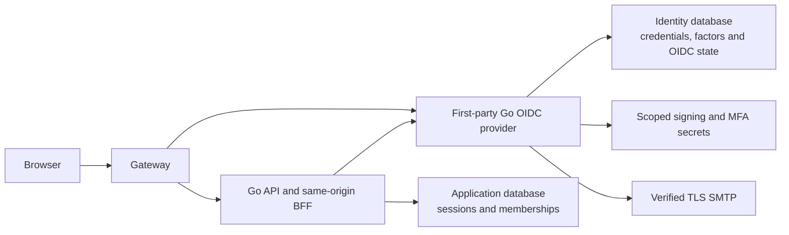

# First-Party Go OIDC Authentication Replacement ExecPlan

This ExecPlan is a living document. Keep `Progress`, `Decision Log`,
`Discoveries`, and `Outcome` synchronized with actual work. Follow
[`docs/PLANS.md`](../../PLANS.md), the repository
[`AGENTS.md`](../../../AGENTS.md), and the literal evidence vocabulary in the
[`output contract`](../../agent-harness/output-contract.md).

## Status

- Plan status: `active`
- Current result: Task 0 intake of both source collections and architecture
  selection are `verified locally`; implementation is `not run`.
- Current provider: Keycloak remains required and must not be removed or
  weakened during development.
- Product status: `candidate-only`; release is `release pending`;
  `production-ready: not established`.
- Next concrete todo: execute Task 1's bounded OIDC library/interoperability
  spike and freeze the provider-neutral contracts before creating `apps/auth`.

## Objective

Replace the Keycloak runtime, after complete local and later separately
authorized release qualification, with a small separately privileged Go OIDC
provider built from selected first-party authentication concepts and tests,
with a maintained authorization-server library. Preserve AviaSurveil360's existing
same-origin BFF, encrypted browser sessions, CSRF controls, immutable subject
identity, exact organization isolation, application-owned role authorization,
MFA, lifecycle revocation, recovery, redacted audit, and rollback behavior.

## User-Visible Outcome

Users continue to sign in and out through the same AviaSurveil360 origin. They
receive standards-based OIDC login, TOTP MFA, recovery codes, verified email,
password reset, session management, and localized identity messages in English,
Turkish, French, and Portuguese. Application screens continue to expose only
the exact role and organization authorized by server-owned membership state.

The long-term runtime replaces the Keycloak JVM with one bounded non-root ARM64
Go service. No user should be able to distinguish the provider replacement by
weaker authentication, changed subject identity, broader authorization, lost
history, or an unsafe browser-token contract.

## Scope

This plan owns:

- integrity-retained intake, comparison, and security mapping for both
  owner-provided source collections;
- the first-party Go provider architecture and implementation;
- canonical identifiers, passwords, account state, provider sessions, OIDC,
  signing-key rotation, TOTP, recovery codes, verification/reset, SMTP-backed
  identity messages, security audit, and provider administration;
- provider-neutral adapters in the current API while preserving application
  membership and session boundaries;
- local PostgreSQL, Mailpit, Compose, gateway, browser, recovery, image, and
  native ARM64 verification;
- synthetic subject migration and explicit rollback qualification; and
- later removal of Keycloak only after all gates and a separate cutover and
  retention/destruction authorization.

## Explicit Exclusions

- No public self-registration.
- No automatic federation, social login, LDAP, SAML, dynamic client
  registration, or third-party identity brokerage.
- No custom cryptographic algorithms, JWT parser, authorization-code protocol,
  or hand-written OIDC replacement when a maintained library owns the boundary.
- No direct application of the imported evaluation migration.
- No direct import of the Kindred DynamoDB repository, full-row user updates,
  AppSync/API Gateway wiring, or application/mobile domain code.
- No import of the export's `app.users`, `staff_permissions`, city, profile, or
  application authorization model.
- No ambiguous Keycloak/native dual-issuer fallback.
- No real password, TOTP seed, recovery code, token, private key, production
  identity, or customer data in repository evidence or local fixtures.
- No AWS, Cloudflare, SMTP-provider, DNS, certificate, secret, RDS, production
  migration, identity load, deployment, traffic, cutover, rollback, retention,
  destruction, or residue action without separate exact authorization.
- WebAuthn/passkeys are not a first-cutover commitment until the owner records
  that separate product decision; TOTP and hashed recovery codes are mandatory.

## Owner Decisions And Assumptions

- On 2026-08-11 the owner stated that the exported application code is entirely
  their own and may be copied, modified, and integrated. Third-party dependency
  licenses still apply.
- Both retained source collections are candidate evidence. Neither is a
  deployable OIDC provider or permission to enable imported runtime code.
- The selected direction is a separate Go provider, not identity code embedded
  into the ordinary API. This keeps credentials, factors, signing keys, and
  provider sessions outside the normal API/worker blast radius.
- Keycloak remains the serving and rollback provider until cutover acceptance.
- The existing API remains an OIDC relying party and continues to own encrypted
  browser sessions and application authorization.
- The imported source is reference input. Reuse means reviewed adaptation, not
  bulk copy into a runtime build.

## Repository Orientation And Evidence

- Raw intake receipt:
  [`docs/security/auth-replacement/evidence/2026-08-11-first-party-auth-export/IMPORT_RECEIPT.md`](../../security/auth-replacement/evidence/2026-08-11-first-party-auth-export/IMPORT_RECEIPT.md)
- Retained exact ZIP SHA-256:
  `7fa982300440cb3e79d28bc0f7f22ebb59124bc9c125dededb22dea306fc7fb7`
- Second raw intake receipt:
  [`docs/security/auth-replacement/evidence/2026-08-11-kindred-auth-export/IMPORT_RECEIPT.md`](../../security/auth-replacement/evidence/2026-08-11-kindred-auth-export/IMPORT_RECEIPT.md)
- Second retained exact ZIP SHA-256:
  `5de123c9bd8a711889e85b1876329540dee49423f64568c0a4bade4b5a4ff79b`
- Source selection matrix:
  [`source-comparison.md`](../../security/auth-replacement/hardening/source-comparison.md)
- Imported security review:
  [`SECURITY_REVIEW.md`](../../security/auth-replacement/evidence/2026-08-11-first-party-auth-export/source/auth-export/SECURITY_REVIEW.md)
- Hardening portfolio:
  [`hardening.md`](../../security/auth-replacement/hardening/hardening.md)
- Selected implementation handoff:
  [`separate-go-oidc-provider.md`](../../security/auth-replacement/hardening/implementation/separate-go-oidc-provider.md)
- Current OIDC relying party: `apps/api/internal/identity/oidc_remote.go`
- Current provider administration: `apps/api/internal/identity/keycloak_admin.go`
- Current application sessions: `apps/api/internal/platform/session/`
- Current BFF endpoints: `apps/api/internal/httpapi/auth.go`
- Current browser client: `apps/web/src/auth/`
- Current identity contract:
  `docs/product-specs/data-and-rules/PREPROD_IDENTITY_AND_DATA_PROFILE.md`
- Current recovery runbook: `docs/operations/runbooks/IDENTITY_MFA.md`

## Target Trust Boundary



The provider establishes authentication and one immutable subject. The API
remains the application authorization authority. Provider role/organization
observations, if retained for reconciliation, must match the exact current
server-owned desired membership; they never bypass database-scoped policy.

## Binding Security Invariants

1. Every protected request resolves one immutable subject and one exact active
   application membership before domain access.
2. CAA roles belong only to `CAA`; an Auditee belongs to exactly one non-CAA
   organization; invalid or multiple authority fails closed.
3. Public self-registration is disabled. Provisioning is administrative,
   revisioned, audited, and invitation-based.
4. Password verification is enumeration-resistant and bounded by input,
   per-source, per-principal, global rate, and Argon2id concurrency limits.
5. Password change, reset, refresh reuse, suspension, lock, deactivation, role
   change, organization transfer, and MFA reset revoke every affected provider
   and application session.
6. OIDC uses exact issuer, registered client, exact redirect URI,
   Authorization Code plus PKCE, state, nonce, short-lived codes, ID tokens,
   algorithm allowlists, stable `kid`, and controlled key rotation.
7. Keycloak and replacement issuers, keys, clients, databases, cookies, and
   sessions are distinct. Verification never falls back between them.
8. TOTP secrets are protected, time-window replay is rejected, and recovery
   codes are random, hashed, single-use, regenerated only after step-up, and
   never logged.
9. Verification and reset challenges are random, hashed at rest, single-use,
   expiring, attempt-bounded, and delivered only over verified TLS/STARTTLS.
10. Security audit is append-only, bounded, redacted, and explicit about which
    failures block the operation versus alert asynchronously.
11. Normal API and worker code cannot access password hashes, raw factor
    secrets, reset values, issuer private keys, or identity SMTP credentials.
12. No implementation result is called production-ready without current
    protocol, dependency, independent security, recovery, and ARM64 evidence.

## Ordered Tasks

### Task 0 — Preserve And Classify The Source Input

Status: `verified locally`.

- Verify both owner-provided ZIP digests.
- Reject traversal, absolute, duplicate, corrupt, or symlink entries.
- Retain the exact archive and extracted bytes outside runtime builds.
- Record the owner code-ownership decision and candidate-only boundary.
- Inspect both exports' reviews, capability matrices, persistence, protocol
  claims, dependencies, server/client primitives, and current Avia identity
  boundaries.
- Select the separate Go provider architecture and record alternatives.

Acceptance: both retained archives match their supplied digests; extracted
bytes match the inspected trees; no imported runtime is enabled.

### Task 1 — Freeze Protocol And Provider-Neutral Contracts

Status: `not run`.

- Compare maintained Go authorization-server libraries using primary source,
  current maintenance, license, protocol ownership, testability, dependency,
  and ARM64 criteria.
- Build a disposable interoperability spike for discovery, Authorization Code
  plus PKCE, exact redirects, state, nonce, token exchange, ID-token
  verification, JWKS, key rotation overlap, and RP-initiated logout.
- Define provider-neutral interfaces for account provisioning, authority
  observation, lock/suspend/deactivate, required actions, MFA state, session
  revocation, and recovery without preserving Keycloak-shaped APIs.
- Freeze browser, issuer, claim, admin, audit, failure, readiness, and secret
  contracts. Map `AS360-AUTH-001` through `AS360-AUTH-030` to tests. The second
  collection adds conditional refresh, subject-bound logout, password-change
  revocation, security-state concurrency, verification-gate, cross-transport
  throttling, long-lived-session, key-rotation, HMAC-drift, client-refresh,
  OTP-attempt, and expensive-input regression contracts.

Acceptance: one maintained library is selected with evidence; the current API
can consume the spike without insecure issuer handling; the contract review has
no unresolved High design blocker.

### Task 2 — Scaffold The Isolated Provider

Status: `not run`.

- Create `apps/auth/` as a separate Go module or repository-consistent module
  surface after checking current module conventions.
- Add strict typed configuration, startup validation, liveness, readiness,
  redacted telemetry, non-root ARM64 image, no-new-privileges, dropped
  capabilities, bounded PIDs/resources/logs, and no Docker socket.
- Give the provider a separate database role/schema or logical database,
  signing/MFA secret set, and SMTP identity. Normal API and worker roles receive
  none of those secrets.
- Upgrade imported dependency concepts to current reviewed versions and retain
  required notices.

Acceptance: the empty provider starts only with complete safe configuration,
fails closed on missing/placeholder/weak key material, and is not routed by a
normal profile.

### Task 3 — Identity, Password, Account-State, And Abuse Controls

Status: `not run`.

- Implement immutable opaque subjects and one canonical type-aware identifier
  table with verified email state and cross-field uniqueness.
- Implement invited, active, disabled, suspended, locked,
  deletion-pending, and deleted states as required by product policy; every
  login, refresh, token, session, and admin path checks state fail closed.
- Adapt Argon2id only after bounding encoded parameters, password size,
  concurrency, and admission. Add policy, current-password reuse denial,
  history, compromised-password decision, and rehash-on-success.
- Use a fixed dummy hash and generic outcomes for unknown identifiers. Add edge
  and application throttling on every public auth transport without creating
  attacker-triggered permanent lockout. Trust forwarded client identity only
  from the configured gateway and fail closed when sensitive-operation limiter
  state cannot be established.
- Remove public registration. Add revisioned administrative invitation and
  activation.

Acceptance: focused unit/race/PostgreSQL tests close the mapped password,
registration, identifier, account-state, throttling, and authorization defects.

### Task 4 — Provider Sessions And Refresh Families

Status: `not run`.

- Implement cryptographically random provider sessions and refresh families,
  hashes at rest, row-lock rotation, reuse detection, absolute and idle expiry,
  issuance auth version, bounded session counts, and durable cleanup.
- Make every security-state mutation conditional or revision checked so stale
  refresh, password, lockout, lifecycle, or factor writes cannot restore prior
  authority.
- Make password/lifecycle/factor changes revoke all prior families. If the
  current browser remains signed in, replace its family atomically and return
  only the new credential.
- Validate clients before writing a session and avoid orphan rows.
- Define trusted-proxy-aware keyed fingerprints without retaining raw
  attacker-controlled user-agent or address values.

Acceptance: concurrent refresh/reuse, password change, lock, suspend,
deactivate, cleanup, and crash recovery pass PostgreSQL integration and race
tests.

### Task 5 — Standards-Conforming OIDC Provider

Status: `not run`.

- Implement discovery, exact client and redirect registry, Authorization Code
  plus PKCE, state/nonce binding, ID/access/refresh tokens, userinfo only when
  required, JWKS, stable key IDs and overlap rotation, revocation, and logout
  through the selected maintained library.
- Keep authorization codes short-lived, single-use, client/redirect/PKCE-bound,
  and hashed or library-protected at rest.
- Reject weak signing keys, unsupported algorithms, insecure production
  issuer URLs, clock anomalies beyond an explicit skew, and initialization
  errors. Readiness includes signing and verification state.
- Do not copy the candidate's discovery-shaped proprietary metadata.
- Bind logout/revocation to the authenticated subject and exact session, and
  make legacy HMAC configuration incapable of altering the RS256/OIDC path.

Acceptance: positive and negative protocol/interoperability suites pass against
the current API OIDC client; no dual issuer or algorithm fallback exists.

### Task 6 — MFA, Recovery, Verification, Mail, And Localization

Status: `not run`.

- Implement TOTP enrollment/challenge with encrypted secrets and replay-window
  consumption, plus random hashed single-use recovery codes.
- Implement verified-email invitation, verification, reset, factor recovery,
  and administrative recovery using expiring hashed attempt-bounded challenges.
- Reuse the project's verified TLS/STARTTLS SMTP transport through a narrow
  identity mail port with separate credentials and durable retry/audit policy.
- Add identity catalogs and safe templates for `en`, `tr`, `fr`, and `pt`;
  confirm whether Portuguese is `pt-PT`, `pt-BR`, or shared neutral content.
- Never place tokens in logs, telemetry, subject lines, or unrelated URLs.

Acceptance: enrollment, replay denial, recovery-code consumption, reset reuse,
expiry, throttling, SMTP downgrade denial, delivery retry, and four-locale
rendering pass focused and Mailpit integration tests.

### Task 7 — Security Audit And Provider Administration

Status: `not run`.

- Implement an append-only redacted event schema for registration denial,
  invite, verification, login success/failure, refresh/reuse, logout, password,
  reset, identifier, MFA, factor recovery, lock, lifecycle, session, client,
  key, and admin events.
- Decide and test fail-closed versus alert-only behavior per event class.
- Implement a narrow authenticated internal API for provisioning, provider
  observation, account state, required actions, MFA state, and revocation.
- Scope provider administration through least privilege and exact subject
  identity; no browser receives provider admin authority.

Acceptance: missing/failed audit and authorization paths behave exactly as the
contract states; credentials and unbounded attacker input never enter events.

### Task 8 — Adapt AviaSurveil360 Without Weakening Authorization

Status: `not run`.

- Replace `KeycloakAdminClient` ownership with provider-neutral interfaces and
  implementations while Keycloak remains supported only as the active
  migration baseline.
- Preserve current BFF cookies, CSRF, login-state/nonce/PKCE, provider logout,
  application sessions, authority observations, membership revisions, offline
  subject lock, and repository-level organization predicates.
- Keep organization and role authority server-owned. Claims must match the
  expected membership when claim reconciliation remains enabled.
- Add provider-independent API and React flows for login, logout, sessions,
  password, verification, TOTP, recovery codes, reset, and admin lifecycle.
- Serialize concurrent refresh work at every applicable client boundary and
  clear the complete local session after terminal refresh rejection. Revalidate
  or disconnect authenticated long-lived channels on token expiry, auth-version
  change, suspension, password reset, logout, and deactivation.

Acceptance: the existing role/organization/privacy matrix and negative tests
pass against both explicit profiles, never through fallback.

### Task 9 — Isolated Local Qualification And Synthetic Migration

Status: `not run`.

- Add a distinct local profile with a different issuer, client, database, keys,
  cookies, ports, and synthetic identities. Keep the normal Keycloak profile
  unchanged.
- Create exact opaque synthetic subjects from an approved manifest; never
  derive subjects from mutable identifiers.
- Run complete browser login/logout/TOTP/recovery/reset/session/lifecycle,
  organization denial, accessibility, restart, dependency-loss, backup,
  restore, key-rotation, and rollback scenarios.
- Prove that a bootstrap or break-glass provider identity without application
  membership cannot obtain application authority.

Acceptance: full synthetic qualification is `verified locally`, task-owned
state is removed, and Keycloak remains a tested rollback provider.

### Task 10 — Security, Dependency, Recovery, And ARM64 Gates

Status: `not run`.

- Run formatting, vet, unit, PostgreSQL integration, race, fuzz, protocol,
  browser, accessibility, contract, migration, backup/restore, and failure
  suites.
- Run current dependency, license, secret, misconfiguration, SBOM/provenance,
  and image scans. Validate reachability; do not dismiss findings by package
  name alone.
- Obtain independent security review of authentication, OIDC, MFA, recovery,
  organization, migration, key custody, audit, and rollback paths.
- Measure the complete native ARM64 gateway/API/worker/identity workload under
  steady, login burst, Argon2id abuse, PDF, notification, and recovery load.

Acceptance: no unresolved cutover blocker; required headroom passes without
weakened security or sustained swap. Otherwise record literal `NO-GO` and keep
Keycloak.

### Task 11 — Approval-Bound Cutover And Keycloak Retirement

Status: `not run`; requires separate exact authorization.

- Inventory whether any non-synthetic identity exists. If yes, create a
  separate exact migration and recovery plan; never improvise password or TOTP
  export.
- Review one immutable release, migration, issuer/route, smoke, rollback,
  observation, and retention bundle.
- Obtain separate exact authorization for each production identity, secret,
  migration, deployment, cutover, smoke, recovery, rollback, retention,
  destruction, and residue wave.
- Remove Keycloak runtime, database, secrets, image subjects, code, and
  runbooks only after cutover acceptance and retention/destruction approval.

Acceptance: separately authorized real evidence passes. Until then Keycloak is
not retired and no production-ready claim is permitted.

## Verification Commands And Expected Observations

Commands evolve as `apps/auth` is created. Each task must record exact commands
and fresh results. The minimum expected local gate includes:

```bash
gofmt -w apps/auth
go test ./...
go test -race ./...
go vet ./...
npm --prefix apps/web run typecheck
npm --prefix apps/web test
node --test deploy/local/keycloak/realm-contract.test.mjs
./scripts/test-http-oidc-profile.sh
git diff --check
```

Run Go commands from the relevant module and use task-owned cache/database
paths. Add focused auth commands before broad repository gates. Expected
observations are zero formatting/vet/test errors, exact negative OIDC and
organization denials, no secret output, and zero task-owned runtime residue.
Commands that require code not yet created remain `not run`; do not manufacture
passing placeholders.

## Risks And Mitigations

- **Protocol correctness:** use a maintained library, interoperability and
  negative tests, and independent review.
- **New provider ownership:** maintain complete rotation, recovery, backup,
  audit, monitoring, and incident runbooks before cutover.
- **Tenant drift:** keep application authorization and repository scoping in
  AviaSurveil360; reconcile provider observations exactly.
- **Credential abuse and t4g.small exhaustion:** layer rate limits, bounded
  Argon2id work, queue visibility, and native mixed-load measurement.
- **Migration identity loss:** retain exact subjects and append-only mappings;
  never derive identity from email or username.
- **Rollback ambiguity:** distinct issuers and one configured verifier at a
  time; retain Keycloak until post-cutover acceptance.
- **Dirty-tree conflict:** refresh each touched file, preserve unrelated user
  changes, and stop if overlapping intent cannot be reconciled safely.

## Idempotence And Recovery

- Source intake is content-addressed and must not be rewritten.
- Migrations are forward-only, checksum-recorded, transactionally applied, and
  tested on disposable PostgreSQL before use.
- Provisioning, invitation, reset, factor, session, and provider-admin commands
  use stable operation IDs and expected revisions; replay returns the prior
  result or a typed conflict without duplicate delivery or authority.
- Refresh rotation and factor consumption use row locks/unique constraints so
  a crash cannot issue two valid successors.
- Key and issuer rollback is a reviewed configuration/release operation, not a
  verifier fallback.
- Any failed migration or cutover retains Keycloak data and immutable images;
  no cleanup/destruction occurs before explicit retention disposition.

## Progress

- [x] 2026-08-11 — Owner confirmed first-party source ownership and authorized
  repository intake and a separate Auth Replacement ExecPlan.
- [x] 2026-08-11 — Both ZIP SHA-256 values matched the supplied digests;
  archives and exact extractions retained under
  `docs/security/auth-replacement/evidence/`.
- [x] 2026-08-11 — Retained-copy archive, high-signal secret, offline module,
  auth/export race, vet, hardening JSON, harness-docs, and diff checks passed;
  PostgreSQL, current vulnerability, OIDC, integration, and ARM64 gates remain
  `not run`.
- [x] 2026-08-11 — Export and current Avia identity boundaries inspected;
  direct schema/runtime import rejected.
- [x] 2026-08-11 — Security hardening portfolio selected the separate Go OIDC
  provider with Keycloak retained as baseline and rollback.
- [x] 2026-08-11 — Second source manifest, archive structure, extraction, and
  high-signal secret checks passed. Its fresh focused Go test was `blocked` by
  unavailable offline module versions; DynamoDB Local, OIDC, fuzz, mobile, and
  ARM64 gates remain `not run`.
- [x] 2026-08-11 — Comparative review retained RS256/JWKS negative-test,
  lifecycle, distributed-limit, and client refresh-serialization concepts;
  direct DynamoDB/runtime reuse was rejected and twelve regression contracts
  were added.
- [ ] Task 1 — OIDC library/interoperability and provider-neutral contracts.
- [ ] Tasks 2–10 — Local implementation and qualification.
- [ ] Task 11 — Separately authorized cutover and retirement.

## Decision Log

- 2026-08-11: Source licensing blocker closed by the owner's explicit ownership
  statement; third-party notices remain required.
- 2026-08-11: Preserve exact export as immutable evidence rather than placing
  known-defective candidate code directly in an application build.
- 2026-08-11: Preserve the second exact export beside the first and adapt
  selected concepts only. Do not import its DynamoDB persistence, minimal
  discovery facade, or application/mobile domain runtime.
- 2026-08-11: Preserve OIDC and the existing same-origin BFF rather than moving
  browser refresh tokens into JavaScript.
- 2026-08-11: Prefer a separately privileged Go provider over embedding
  credential/MFA/signing authority in the API.
- 2026-08-11: Keep Keycloak serving until parity, migration, independent
  security, recovery, rollback, and ARM64 gates pass.
- 2026-08-11: TOTP and recovery codes are mandatory; WebAuthn remains an open
  product decision.

## Discoveries

- The export is native password/session authentication with proprietary JWTs,
  not an OIDC client or conforming OIDC authorization server.
- The second export is also proprietary authentication, despite an RS256
  issuer and discovery/JWKS facade. It is neither a conforming OIDC provider nor
  an OIDC relying party.
- Its strongest reusable elements are Argon2id, random identifiers, exact JWT
  algorithm checks, row-lock refresh rotation, and family-reuse concepts.
- Its evaluation schema duplicates application user and permission concerns
  already owned more strongly by AviaSurveil360; importing it would create an
  unsafe second authorization authority.
- AviaSurveil360 already has a robust BFF/session/CSRF and desired-membership
  foundation. The replacement can focus on provider credentials, factors,
  OIDC, recovery, and provider administration.
- Password change refresh-family survival, unbounded Argon2id work, incomplete
  audit, absent tenant isolation, and misleading discovery are explicit
  regression targets, not accepted debt.
- The second export adds concrete stale-write, cross-account logout,
  verification-gate, GraphQL rate-limit, WebSocket revocation, key-rotation,
  legacy-HMAC, OTP-attempt, and body-size regression targets. Its Swift refresh
  actor is useful client-behavior evidence but does not change the BFF rule that
  browser JavaScript never holds provider refresh tokens.

## Outcome

Task 0 is `verified locally`: both source collections are preserved,
integrity-bound, classified, compared, and linked to a selected architecture
and implementation plan. No
runtime code, dependency, migration, Compose service, identity, or external
system was changed by this plan yet. Implementation remains `not run`. The
result is `candidate-only`, release is `release pending`, and
`production-ready: not established`.

## Execution Prompt

Continue
`docs/exec-plans/active/2026-08-11-first-party-go-oidc-auth-replacement-plan.md`
from its next incomplete task. Read `AGENTS.md`, `docs/PLANS.md`, this complete
plan, the plan index, the technical-debt tracker, `ARCHITECTURE.md`, both raw
auth export receipts, their complete retained review/integration documents,
the source comparison, the
hardening portfolio and selected implementation handoff, the current OIDC,
Keycloak administration, session/BFF, React auth, identity profile, MFA
runbook, Compose, gateway, SMTP, migration, recovery, and AWS private-pilot
runtime sources before editing. Preserve all unrelated dirty-tree changes.

Start with Task 1 only: compare maintained Go authorization-server libraries
using primary evidence, implement a disposable standards spike, and freeze the
provider-neutral contracts and `AS360-AUTH-001` through `AS360-AUTH-030` test
map. Do not bulk-copy either imported store or apply the evaluation migration.
Keep Keycloak active and do not enable dual-issuer fallback. Use `apply_patch` for manual
edits, run focused tests, and update plan/index/tracker evidence literally.

Do not stage, commit, push, deploy, publish, mutate AWS/Cloudflare/SMTP, touch
production/customer identity or data, migrate RDS, change DNS/certificates or
secrets, cut over traffic, remove Keycloak, or destroy/retain provider state
without separate exact authorization.
