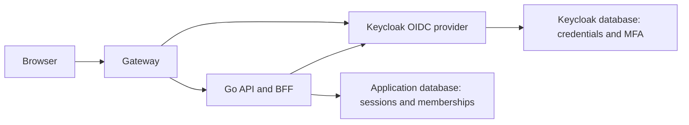
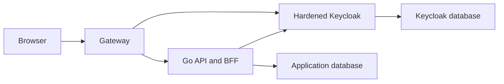
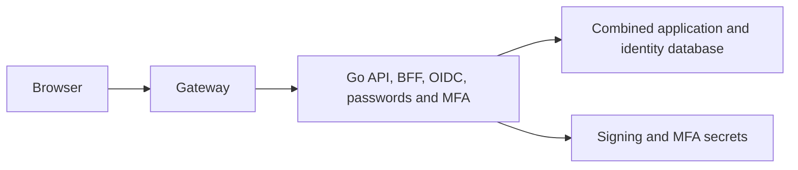
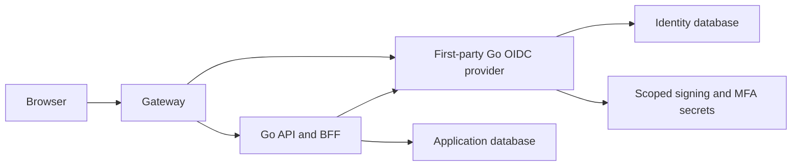

# Security Hardening Proposal: First-Party Identity Boundary

## Decision

Decide whether and how to replace Keycloak with first-party Go authentication
without weakening OIDC interoperability, immutable subject identity,
organization isolation, MFA, session revocation, audit, or recovery.

## Executive Recommendation

We have three real options. Option 1, **Retain and harden Keycloak**, preserves
the mature provider and accepts its JVM resource and operational cost. Option 2,
**Embed native identity in the API**, minimizes process overhead but gives the
ordinary application credential, MFA, and signing authority. Option 3,
**Separate first-party Go OIDC provider**, keeps a dedicated security boundary
while replacing Keycloak's heavier runtime.

I recommend Option 3 under the current long-term and ARM64 constraints. We
should keep Option 1 live as the migration and rollback baseline until Option 3
passes every protocol, lifecycle, tenant, recovery, security, and capacity
gate. Option 2 should win only if measured memory proves that even a small Go
provider cannot fit and the team explicitly accepts the larger compromise
blast radius.

## Evidence

| Evidence | Finding or document | What it establishes |
|---|---|---|
| `AUTH-EXPORT-1` | [First-party auth export](../../evidence/2026-08-11-first-party-auth-export/IMPORT_RECEIPT.md) | Integrity-retained native password, JWT, PostgreSQL refresh-session, store, and test input. |
| `AUTH-REVIEW-1` | [First export security review](../../evidence/2026-08-11-first-party-auth-export/source/auth-export/SECURITY_REVIEW.md) | Eighteen reported gaps, including protocol, authorization, account state, throttling, refresh, audit, dependency, and tenant concerns. |
| `AUTH-EXPORT-2` | [Kindred auth export](../../evidence/2026-08-11-kindred-auth-export/IMPORT_RECEIPT.md) | Integrity-retained RS256 JWT, DynamoDB session/lifecycle, rate-limit, WebSocket, and native-client reference input. |
| `AUTH-REVIEW-2` | [Kindred security review](../../evidence/2026-08-11-kindred-auth-export/source/reports/security-review.md) | Confirms missing OIDC flows and key rotation plus unsafe refresh, logout, password-change, verification, WebSocket, throttling, and full-row concurrency behavior. |
| `AUTH-COMPARISON` | [Source comparison](../source-comparison.md) | Selects concepts rather than runtimes and defines `AS360-AUTH-019` through `AS360-AUTH-030`. |
| `AVIA-IDENTITY` | Current OIDC and session source | The application already owns Authorization Code plus PKCE consumption, BFF cookies, CSRF, server-side sessions, and authority observation. |
| `AVIA-POLICY` | Current identity/data profile and MFA runbook | Public registration is disabled; one exact role and organization, TOTP, subject retention, lifecycle revocation, and recovery are binding. |

I inspected the imported code and the current application boundaries directly.
The evidence most strongly influencing this diagnosis is the mismatch between
the first source's proprietary issuer and duplicate
`app.users`/`staff_permissions` model, the second source's non-conforming
discovery facade and unsafe DynamoDB security-state concurrency, and
AviaSurveil360's already-developed application membership and BFF session
model. Those mismatches make direct runtime integration unnecessary and
dangerous.

## Current Design And Failure Mode

Today Keycloak authenticates users, stores passwords and TOTP state, publishes
OIDC discovery/JWKS, and exposes provider administration. The API is an OIDC
relying party and creates its own encrypted browser session only after exact
issuer, nonce, email, role, organization, and provider-observation checks.

Both imported candidates issue proprietary JWTs and refresh values but do not
implement authorization codes, PKCE, ID tokens, registered redirect URIs, a
token endpoint, userinfo, conforming logout, or client credentials. The Kindred
candidate's discovery/JWKS facade therefore cannot replace Keycloak. The first
candidate's user and staff scope tables would create a second application
authority; the second candidate has no role, permission, organization, or
tenant model and uses unsafe full-row DynamoDB updates. We would have no single
owner for tenant truth and no sound concurrency boundary if either runtime were
imported directly.

## Desired Invariants

- One identity provider establishes one immutable opaque subject.
- The API resolves and enforces one exact active application membership for
  every protected request; identity claims never replace repository scoping.
- Discovery, authorization, token, ID-token, JWKS, and logout behavior is
  standards-conforming and library-backed.
- Password change, refresh reuse, suspension, deactivation, MFA reset, and
  account lock revoke all affected provider and application sessions.
- Password hashes, MFA secrets, signing keys, reset values, and SMTP secrets
  are inaccessible to normal worker code and never enter logs or evidence.
- Keycloak and the replacement have distinct issuer identities, and no verifier
  tries one after the other.

## Constraints And Non-Goals

The first cutover must support the existing browser and API, TOTP, hashed
recovery codes, verified email/reset delivery, administrative provisioning,
account lifecycle, four locales (`en`, `tr`, `fr`, `pt`), and redacted audit.
WebAuthn can be deferred only by an explicit decision because it is not part of
the current demonstrated Keycloak contract. Federation, social login, LDAP,
dynamic client registration, and public self-registration are non-goals unless
separately authorized.

## Before Architecture

The current provider is isolated from normal application code, but its JVM and
database operations consume meaningful single-host capacity.

## Options

### Option 1: Retain and harden Keycloak

The strongest case for keeping Keycloak is not inertia. It already supplies the
protocol and factor behavior that the candidate lacks, and the repository has
realm, TOTP, provider-observation, recovery, and browser evidence built around
it. We would continue to patch and pin its image, measure it honestly, and
avoid taking ownership of an authorization server.

This option leaves the private pilot's largest identity resource footprint and
its JVM dependency burden in place. If the final mixed ARM64 workload still has
the required headroom after the other runtime simplifications, that cost may be
proportionate. Rollback is simply the previous immutable reviewed image and
realm; there is no subject or credential migration.

| Change | Before | After | Security consequence | Cost |
|---|---|---|---|---|
| Provider | Keycloak | Hardened Keycloak | Mature protocol and MFA retained | JVM, patch, and database burden remains |
| Candidate export | Not used | Evidence only | Reported candidate defects remain unreachable | No native reuse benefit |

### Option 2: Embed native identity and OIDC into the API

This option has the smallest service count. We could reuse the API's existing
BFF/session implementation and add password, MFA, OIDC, and administration
packages in the same process. There is no local provider network hop and no
separate service supervision.

What gives me pause is authority concentration: any API exploit that reaches
configuration or database adapters could also reach password verification,
MFA secrets, and issuer signing. API deploys and failures would simultaneously
remove login and recovery. Package boundaries help developers but do not
provide process, credential, database-role, or secret isolation. Rollback also
becomes a coordinated API and issuer rollback rather than an edge route change.

| Change | Before | After | Security consequence | Cost |
|---|---|---|---|---|
| Credential authority | Isolated provider | Main API | Larger compromise blast radius | Lowest process overhead |
| Failure boundary | Provider separate | API and provider share fate | Login/recovery fails with API | Simpler supervision |

### Option 3: Separate first-party Go OIDC provider

This option replaces Keycloak with a small Go service whose only job is
authentication: canonical identifiers, password and reset policy, TOTP and
recovery, provider sessions, standards-based OIDC, signing-key publication,
mail initiation, provider administration, and security audit. It receives a
separate database role and secret set. The normal API remains an OIDC client and
continues to own application sessions and authorization.

The attractive part is that we can reuse the candidates' strongest mechanics
without importing either authority or persistence model. A maintained authorization-server
library owns protocol-critical parsing and state transitions; our code owns
Avia-specific lifecycle and integration. Argon2id work receives explicit edge
rate limits and an in-process concurrency budget so a login flood cannot consume
the t4g.small. The API talks to a narrow internal administration interface
rather than Keycloak-specific endpoints.

This is still a serious operational commitment. We own migrations, key
rotation, factor recovery, delivery, abuse controls, alerting, backup/restore,
and incident response. A library does not make those correct. The safe rollout
therefore keeps Keycloak intact, tests the new provider under a different
issuer, migrates only synthetic identities first, and performs one explicit
cutover with a tested route and data rollback.

| Change | Before | After | Security consequence | Cost |
|---|---|---|---|---|
| Provider implementation | Keycloak JVM | Dedicated Go service | Isolation retained with smaller expected footprint | Team owns provider correctness |
| Application authority | Provider claims plus app checks | Same app-owned membership checks | Tenant boundary stays in the application | Admin adapter migration |
| Candidate source | External evaluation | Selected primitives only | Known defects become explicit tests | Refactoring rather than copy-paste |

## Comparison

| Dimension | Option 1: Keycloak | Option 2: Embedded API | Option 3: Separate Go provider |
|---|---|---|---|
| Security | Mature provider; current isolation | Credential/signing authority concentrated | Isolation retained; new code risk |
| Performance | Current local hop | Fewest hops | One small local hop |
| Memory | Highest expected footprint | Lowest expected footprint | Expected between Options 1 and 2; unmeasured |
| Reliability | Known provider behavior | API and identity share fate | Separate failure boundary; new recovery ownership |
| Operability | Existing JVM/realm burden | Simplest service topology | New security-critical service and runbooks |
| Migration | None | High-conflict API migration | Explicit issuer/admin/data cutover |

These directions are source-derived or hypothetical, not measurements. The
decision remains conditional on native ARM64 mixed-load evidence.

## Recommendation

I recommend Option 3 because it is the only option that pursues the desired
resource reduction while keeping credential and signing authority outside the
ordinary API. Option 1 remains a valid final answer if the implementation or
capacity gates fail. Option 2 becomes reasonable only if a measured hard
resource limit outweighs the explicitly accepted security isolation cost.

## Evidence Coverage And Residual Risk

| Evidence | Coverage under Option 3 | Residual risk |
|---|---|---|
| `AUTH-REVIEW-1` and `AUTH-REVIEW-2` — candidate security findings | Addressed through explicit work packages and `AS360-AUTH-001` through `AS360-AUTH-030` regression tests | Implementation may introduce new defects; independent review remains required |
| `AVIA-IDENTITY` — OIDC/BFF/session boundary | Preserved behind a generic provider interface | Keycloak-specific administration must be removed without fallback |
| `AVIA-POLICY` — lifecycle, MFA, subject, and organization contract | Acceptance gate | Provider and application state can drift without durable reconciliation |
| `AUTH-EXPORT-1` and `AUTH-EXPORT-2` — reusable primitives | Selected concepts and tests only | Imported assumptions and dependency advisories require refactoring and scanning |

## Migration And Rollout

Develop the provider under a distinct non-production issuer and database.
Never make API verification accept both issuers. Run browser and provider tests
against one explicit issuer per environment. Preserve Keycloak data, immutable
images, and route configuration until post-cutover acceptance.

For synthetic preproduction identities, create exact opaque subjects through an
audited bootstrap and require fresh password/MFA enrollment. If real identities
exist, stop and create a separately approved migration plan; do not derive
subjects from email or export password/TOTP material casually. Cutover changes
the exact configured issuer and gateway route in one reviewed wave. Rollback
invalidates replacement sessions, restores the Keycloak issuer/route, and
retains application identity references.

## Validation Plan

- Protocol: discovery, Authorization Code plus PKCE, state, nonce, exact
  redirect matching, ID/access/refresh tokens, JWKS rotation, revocation,
  logout, negative client tests, and interoperability with the current API.
- Credential: bounded Argon2id parameters and concurrency, enumeration-resistant
  timing, password policy/rehash/history/reset, refresh reuse, and all-session
  revocation.
- Concurrency: conditional refresh rotation, optimistic security-state writes,
  stale-write denial, terminal client refresh behavior, and crash recovery.
- Lifecycle: invite, verify, activate, suspend, lock, deactivate, recover, MFA
  enroll/reset/replay denial, and exact subject retention.
- Transport: shared abuse limits across every public auth path, trusted-proxy
  identity, fail-closed sensitive limiter errors, and long-lived session
  revalidation or disconnect on revocation.
- Authorization: one exact role and organization, stale-revision denial,
  cross-organization negative tests, and no provider-claim-only bypass.
- Operations: signing-key overlap/retirement, legacy-HMAC rejection, SMTP loss,
  database loss, restart, backup, restore, audit failure, clock skew, cleanup,
  and rollback.
- Quality: unit, PostgreSQL integration, race, fuzz, dependency/license/secret
  scan, independent security review, browser accessibility, and mixed ARM64
  capacity gates.

## Implementation Work Packages

The ordered work packages and acceptance criteria live in
[the implementation handoff](../implementation/separate-go-oidc-provider.md)
and the repository's Auth Replacement ExecPlan.

## Open Questions

- Which maintained Go authorization-server library best fits the required
  feature and maintenance boundary?
- Is WebAuthn required for first cutover, or can it follow verified TOTP and
  recovery codes?
- Will any non-synthetic provider identity exist before cutover?
